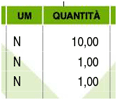

Il Documento di Trasporto (DDT)
===============================
In questo capitolo ci occupiamo del Documento di Trasporto (DDT), chiamato anche Bolla di Trasporto. Nella prima parte vediamo cos'è il DDT, come va compilato e quali sono gli obblighi civilistici e fiscali che comporta. La seconda parte è invece dedicata agli approfondimenti.

Cos'è il Documento di Trasporto o DDT
-------------------------------------
Il `DPR 472/96`_ ha introdotto il Documento di Trasporto (DDT) come sostituzione della precedente Bolla di Accompagnamento. Il DDT certifica un trasferimento di merci dal cedente (venditore) al cessionario (acquirente). La consegna avviene presso la sede indicata dal cessionario quale luogo di consegna. Il trasporto può essere effettuato sia dal mittente che dal destinatario, oppure utilizzando un trasportatore che si assume l'incarico della consegna.

Il Documento di Trasporto deve essere emesso prima della consegna diretta o dell'affidamento dei beni al trasportatore, e deve contenere l'indicazione alcuni elementi obbligatori. In alternativa può essere inviato al destinatario (via fax, via email o altro) entro il giorno stesso dell'invio della merce. 

.. note:: 

    Consigliamo di accompagnare sempre le merci con il Documento di Trasporto.

Dati obbligatori nel documento di trasporto
^^^^^^^^^^^^^^^^^^^^^^^^^^^^^^^^^^^^^^^^^^^
Segue l'elenco dei dati obbligatori affinché il Documento di Trasporto sia valido fiscalmente. Come al solito per gli esempi ci serviremo di `Amica Fatturazione`_.

1. Generalità complete di Partita IVA del venditore (cedente)

2. Generalità complete di Partita IVA del cliente (cessionario)

.. image:: images/ElementiDDT2.png

3. Numero e data del documento

.. image:: images/ElementiDDT3.png

4. Descrizione dei beni o dei servizi oggetto del contratto con il cliente

.. image:: images/ElementiDDT4.png

5. Quantità dei beni o servizi

6. Riferimento di chi effettua il trasporto (Mittente/Destinatario/Vettore).

.. image:: images/ElementiDDT6.png

Nel caso del vettore vanno indicati i suoi riferimenti identificativi. Se il trasporto avviene con il passaggio delle merci fra diversi Vettori è sufficiente indicare sul DDT le generalità dei primo incaricato. Per alcune merci particolari è necessario individuare anche i dati dettagliati del trasportatore come persona fisica con anche il numero di patente, come ad esempio nel caso di trasporto di carburanti, liquidi speciali, altamente infiammabili ed altro.

7. Il numero dei colli ed il loro peso (facoltativi ma consigliati soprattutto con trasporto a mezzo Vettore)

.. image:: images/ElementiDDT7.png

8. La data in cui le merci lasciano la sede del Cedente (può essere la data del documento oppure una data diversa)

Nell'immagine vediamo un DDT completo:

In questo caso si è scelto di esporre già i prezzi, i totali del documento e altre informazioni non obbligatorie come la banca di appoggio. Indicare i prezzi  può essere utile, sia come promemoria per il cessionario che per velocizzare la successiva emissione della :doc:`fattura di vendita <fattura>` (in `Amica Fatturazione`_ l'operazione diventa facile e veloce e può anche essere automatizzata), ma non è obbligatorio. Anzi, in molte situazioni può essere utile o necessario non esporli come ad esempio i casi in cui il DDT venga maneggiato da persone che non devono conoscere i prezzi praticati.

Aspetti civilistici
^^^^^^^^^^^^^^^^^^^
Ritengo importante ricordare che i documenti di trasporto non rispondono solo all'adempimento della normativa fiscale ma ricoprono anche necessità di carattere civilistico, come ad esempio la tutela e la garanzia per Cedente e Cessionario dell'avvenuta consegna delle merci nonché per una corretta gestione amministrativa. È quindi da valutare caso per caso l'opportunità di certificare con DDT anche operazioni che sarebbero esenti per la legislazione fiscale, anche allo scopo di ottenere dalla controparte una ricevuta dell'effettiva consegna dei beni.

Dopo la soppressione della Bolla di Accompagnamento, l'introduzione del Documento di Trasporto permette alle imprese di continuare ad emettere la :ref:`fattura differita <differita>`, che senza documento di trasporto non avrebbe più avuto senso mancando il giustificativo di consegna.

Trasporto di merci non destinate alla vendita
^^^^^^^^^^^^^^^^^^^^^^^^^^^^^^^^^^^^^^^^^^^^^
Nel caso in cui si effettuino trasporti di merci non destinate alla vendita (conto lavorazione, riparazione, comodato d'uso, ecc.) è necessario un documento di trasporto con apposita causale che dimostri, ad un eventuale contestazione dell'amministrazione, che non si tratta di una vendita simulata ma di una movimentazione di merce legata ad altri fattori e che la merce in oggetto rimane di proprietà del mittente del trasporto. Diversamente l'amministrazione, sulla base dell' art. 53 del decreto IVA, può applicare la presunzione di cessione (o acquisto nel caso di merci in ingresso) ed ipotizzare una cessione senza fattura con le relative conseguenze sanzionatorie.

.. _causale:

Principali causali di trasporto
^^^^^^^^^^^^^^^^^^^^^^^^^^^^^^^
Pur non potendo essere esaustiva, ecco una tabella con le principali causali di trasporto che vengono utilizzate nei DDT e i loro principali campi di applicazione. Potrà essere un'utile strumento per la compilazione corretta delle causali e degli eventuali adempimenti connessi.

+-------------------------+----------------------------------------------------------------------------------------------------+ 
| Causale DDT             | Descrizione                                                                                        |
+=========================+====================================================================================================+
| Vendita                 | utilizzata per trasporto di merce ai fini della cessione ad un cliente. Per i DDT con questa       |
|                         | causale deve essere emessa fattura entro il 15 del mese successivo alla data di effettuazione del  |
|                         | trasporto.                                                                                         |
+-------------------------+----------------------------------------------------------------------------------------------------+ 
| Conto visione           | in questo caso i beni vengono inviati al cliente per essere visionati e poi essere restituiti;     |
|                         | nel caso non vengano restituiti è necessario emettere fattura, che comunque va emessa nel termine  |
|                         | di un anno dall'emissione del DDT.                                                                 |
+-------------------------+----------------------------------------------------------------------------------------------------+
| Conto deposito          | i beni sono inviati presso altra destinazione (magazzino, negozio ecc.) al fine di essere tenuti   |
|                         | in deposito per successive disponibilità.                                                          |
+-------------------------+----------------------------------------------------------------------------------------------------+ 
| Conto vendita           | i beni sono inviati ad un cliente senza cessione immediata; il cliente tenterà di vendere questi   |
|                         | prodotti i quali verranno fatturati solo dopo la loro effettiva vendita. Entro un anno i prodotti  |
|                         | dovranno essere o resi o interamente fatturati.                                                    |
+-------------------------+----------------------------------------------------------------------------------------------------+
| Tentata vendita         | la caratteristica di questa particolare forma commerciale è di effettuare la vendita direttamente  |
|                         | presso la sede del cliente con contestuale consegna dei beni. A tal fine, il venditore carica sul  |
|                         | proprio mezzo un determinato quantitativo e varietà di beni e poi inizia il giro dei clienti cui   |
|                         | consegna immediatamente la merce che riesce a vendere.                                             |
+-------------------------+----------------------------------------------------------------------------------------------------+ 
| Prestito d'uso          | con il prestito i beni vengono inviati al fornitore per poter essere utilizzati durante le         |
|                         | lavorazioni; in questo caso la consegna non è seguita da fattura.                                  |
+-------------------------+----------------------------------------------------------------------------------------------------+
| Conto lavorazione       | la merce viene inviata al fornitore per essere lavorata, rimanendo di proprietà dell'azienda; al   |
|                         | termine della lavorazione viene riconsegnata la merce lavorata o semi-lavorata oppure viene        |
|                         | consegnato un prodotto finito risultato della lavorazione di più beni.                             |
+-------------------------+----------------------------------------------------------------------------------------------------+ 
| Omaggio                 | quando si invia merce in omaggio è obbligatorio emettere la fattura unicamente per la rivalsa      |
|                         | dell'IVA quando previsto dalla normativa                                                           |
+-------------------------+----------------------------------------------------------------------------------------------------+
| Riparazione /           | per questo specifico caso è necessario indicare se si tratta di riparazione in garanzia oppure no  |
| Riparazione in garanzia | perché, nel caso l'operazione non sia coperta da Garanzia, dovrà poi essere emessa fattura per     |
|                         | l'intervento di riparazione.                                                                       |
+-------------------------+----------------------------------------------------------------------------------------------------+
| Reso per accredito      | in questo caso la merce resa viene trattenuta e contestualmente si emetterà una nota di credito    |
+-------------------------+----------------------------------------------------------------------------------------------------+
| Reso per sostituzione   | in questo caso sarà spedito del materiale in sostituzione di quello reso; ci sarà quindi un DDT di |
|                         | consegna dei prodotti in sostituzione come chiusura del reso.                                      |
+-------------------------+----------------------------------------------------------------------------------------------------+

Riepilogando:

- il Documento di Trasporto ha una valenza ai fini fiscali per il rispetto della normativa;
- permette di avvalersi della fatturazione differita;
- consente di non cadere nelle presunzioni di cui all'art. 53 del D.P.R. 633/72;
- permette di movimentare merce per motivazioni diverse dalla cessione/vendita;
- ha valenza di ricevuta ai fini civilistici.

Emissione e conservazione del Documento di Trasporto
----------------------------------------------------
Il Documento di Trasporto deve accompagnare i beni durante il trasporto, oppure  essere spedito (anche via fax o altro mezzo) entro il giorno stesso dell'inizio del trasporto al cessionario. I DDT relativi ai trasporti con fatturazione differita devono essere conservati fino alla scadenza dei termini per l'accertamento.  

.. note:: 

    Si consiglia di conservare i DDT assieme alla fattura in cui le merci consegnate
    sono state fatturate.

Approfondimento
---------------
Nei prossimi paragrafi analizziamo alcuni casi particolari, come quelli in cui si rende necessario rilasciare il DDT anche in relazione all'emissione di altri documenti. Ecco il sommario degli argomenti che tratteremo:

1. Scontrino Fiscale
2. Ricevuta Fiscale
3. Tentata Vendita
4. Beni in conto lavorazione, riparazione, deposito, ecc.
5. Agenti di commercio e campionari
6. I controlli su strada della Guardia di Finanza

Documento di trasporto e scontrino fiscale
^^^^^^^^^^^^^^^^^^^^^^^^^^^^^^^^^^^^^^^^^^
Il Documento di Trasporto, se con causale di cessione beni e completo con l'ammontare dei corrispettivi, sostituisce l'emissione dello :ref:`scontrino fiscale <scontrino>`. I commercianti al minuto ed i soggetti assimilati potranno quindi scegliere, per certificare i corrispettivi, una delle seguenti modalità:

- Emissione di scontrino fiscale
- Emissione di fattura immediata
- Emissione di documento di trasporto integrato con l'ammontare dei corrispettivi e successiva fattura differita

Documento di trasporto e ricevuta fiscale
^^^^^^^^^^^^^^^^^^^^^^^^^^^^^^^^^^^^^^^^^
I contribuenti che sono tenuti all'emissione della :ref:`Ricevuta Fiscale <ricevuta>` per la certificazione dei corrispettivi non devono compilare il Documento di Trasporto. L'emissione della ricevuta fiscale (completa dei dati identificativi del cliente) consente di procedere all'emissione della :ref:`Fattura Differita <differita>` e sostituisce di fatto il documento di trasporto stesso. Premesso che la Fattura Differita va emessa solo ed esclusivamente nel caso di cessione di beni, è opportuno chiarire il comportamento da seguire in caso di prestazioni di servizi che presuppongano la consegna del bene finito o lavorato.

Innanzitutto il comportamento da tenere cambia se la prestazione viene resa in un locale non aperto al pubblico o presso un' impresa, oppure in un locale aperto al pubblico, in forma ambulante o nell'abitazione di un cliente privato.

1. Nel caso di prestazione resa in locale non aperto al pubblico o presso un'impresa l'operazione dovrà essere conclusa con emissione di fattura ordinaria. Il documento di trasporto dovrà essere sempre emesso qualora si renda necessario vincere le presunzioni di cessione, quindi se unitamente alla prestazione vengono fornite merci. Per comprovare la consegna delle merci sarebbe sempre opportuna l'emissione di un documento di trasporto da far controfirmare per ricevuta dal cliente.

2. Nel caso invece la prestazione venga resa in un locale aperto al pubblico o nell' abitazione di clienti privati non è obbligatoria l'emissione della fattura se non a richiesta del cliente e non oltre il momento di effettuazione della prestazione. In questo caso deve essere emessa la Ricevuta Fiscale al momento del suo completamento (fine lavoro).

.. note:: 

    Al fine di vincere la presunzione di cessione all'art. 53 del D.P.R. 633/72
    consiglio sempre l'emissione di un DDT quando si prevede che la prestazione
    venga terminata in una data diversa dalla consegna dei beni.

Documento di trasporto e tentata vendita
^^^^^^^^^^^^^^^^^^^^^^^^^^^^^^^^^^^^^^^^
Nel caso di trasporto di merci per la tentata vendita ci sono due comportamenti diversi da tenere a seconda che per la vendita si emetta fattura immediata o fattura differita:

1. Fatturazione immediata. Si emette un Documento di Trasporto contenente tutti i beni trasportati per la tentata vendita e si emette, al momento delle singole consegne, la relativa fattura consegnandone una copia all'acquirente.
2. Fatturazione differita. Si emette un Documento di Trasporto contenente tutti i beni trasportati per la tentata vendita e si emette, al momento delle singole consegne, un'apposita nota di consegna (o 'scheda clienti') secondo lo schema richiesto dalla gestione, ma contenente gli elementi obbligatori del DDT (di fatto può essere un DDT con numerazione indipendente).

Documento di trasporto e i beni in conto lavorazione, riparazione e deposito
^^^^^^^^^^^^^^^^^^^^^^^^^^^^^^^^^^^^^^^^^^^^^^^^^^^^^^^^^^^^^^^^^^^^^^^^^^^^
Nel caso di consegna di beni a terzi (ovvero da parte di terzi) in conto lavorazione, deposito, comodato ovvero in dipendenza di contratti estimatori o contratti d'opera, appalto, trasporto, mandato, commissione o altra motivazione che non configura il trasferimento di proprietà, il DDT costituisce una delle prove valide per vincere la presunzione di cessione (ovvero di acquisto nel caso di ricezione merci). Per adempiere correttamente al suo scopo il DDT deve contenere la :ref:`causale del trasporto <causale>` e deve essere conservato da entrambe le parti.

Documento di trasporto e gli agenti di commercio: i campionari
^^^^^^^^^^^^^^^^^^^^^^^^^^^^^^^^^^^^^^^^^^^^^^^^^^^^^^^^^^^^^^
Per la consegna del campionario all'agente la ditta mandante emetterà un DDT con specifica causale per evitare la presunzione di cessione; l'agente deve conservare il documento e potrà circolare con il campionario senza emettere alcun DDT in proprio.

Documento di trasporto e guardia di finanza: i controlli su strada
^^^^^^^^^^^^^^^^^^^^^^^^^^^^^^^^^^^^^^^^^^^^^^^^^^^^^^^^^^^^^^^^^^
I controlli dei trasporti su strada spettano esclusivamente alla Guardia di Finanza, che deve verificare la corrispondenza di quanto risultante dal DDT (o dichiarato dal conducente) con le risultanze effettive; successivamente la GdF o l'Ufficio Iva potranno verificare l'eventuale corretta fatturazione.

Domande Frequenti
-----------------
1. Posso emettere in un unico DDT merce in conto lavorazione e vendita? In questo caso nella causale di trasporto cosa metto?

   **Risposta** In questo caso è meglio fare i due DDT separati sia per chiarezza sia per gestire una causale del trasporto univoca, certa e non ambigua.

2. Cortesemente i blocchi di DDT debbono essere vidimati/bollati, oppure possono essere utilizzati dopo il loro acquisto (tipo Buffetti)

   **Risposta** Il DDT è redatto in carta semplice quindi nessuna vidimazione o numeri prestampati tipo le vecchie bolle di accompagnamento. I modelli Buffetti vanno benissimo.

3. Una volta emesso un DDT può essere modificato a penna? Ad esempio stampo un ddt con il numero seriale di un componente e successivamente lo modifico a penna, prima del trasporto, posso farlo? Inoltre il ddt può anche essere redatto a penna? Perdonami ma non riesco a documentarmi e volevo essere sicuro su come sia regolato ad oggi il DDT.

   **Risposta** Si puoi correggerlo a penna purchè la correzione sia (ovviamente) riportata su tutte le copie. Puoi anche compilarlo a penna, nessuna legge può (ad oggi) obbligarti a farlo con un PC, anche ser motivi di tempo, leggibilità e rintracciabilità elettronica è molto conveniente.

4. Se una ditta produce fiori in una serra e li trasporta al luogo di vendita con un camion di proprietà, la merce deve essere accompagnata da documento di trasporto?

   **Risposta** Sì il DDT per trasporto merce da due sedi della stessa azienda è comunque necessario.

5. Siamo un'azienda produttrice ed effettuiamo lavorazioni per c/terzi, ricevendo merce in c/lavorazione, al momento della spedizione del prodotto finito, qual'è la giusta causale da inserire sul DDT?

   **Risposta** La causale è 'Reso da c/lavorazione'.

6. Sono impiegata in una ditta che utilizza DDT in tre copie per abitudine. Vorrei sapere se esiste l'obbligatorietà di pinzare la seconda copia (quella firmata dal cliente) alla relativa fattura (differita) e nel caso di un controllo fiscale cosa comporterebbe l'assenza di questa . La presenza della terza copia nel relativo blocco è però garantita.

   **Risposta** No l'obbligo di allegare il DDT alla fattura non c'è, basta poter esibire il documento a richiesta. La pinzatura rappresenta una comodità gestionale (facilità di reperimento) ed anche dal punto di vista civilistico: in caso il cliente contesti la consegna della merce tu potrai esibire la sua firma di ritiro merce rintracciando immediatamente il documento di consegna (DDT).

7. E' possibile indicare lo stesso numero di DDT su due o più fatture?

   **Risposta** Sì se ci sono delle motivazioni valide. Faccio un esempio: DDT di conto vendita, dopo un mese fatturo alcuni articoli venduti di quel DDT, dopo due mesi fatturo altri articoli venduti di quel DDT e così via… Riporterò sulle varie fatture sempre lo stesso numero DDT come riferimento.

Riepilogo
---------
Il DDT, come abbiamo potuto vedere, è un documento che ricopre molti aspetti sia fiscali che civilistici. E' molto importante per molte aziende, come ad esempio quelle che consegnano merce più volte al mese e fanno poi fattura riepilogativa. Nella realizzazione di un DDT va posta particolare attenzione al fine di evitare sanzioni visto che è il documento che spesso viene controllato su strada dalla Guardia di Finanza.

.. note::

    Utilizzate sempre un DDT quando spostate merci, macchinari o attrezzature
    (salvo i casi di attrezzi specifici per il lavoro degli artigiani) perché
    è il miglior modo per vincere la 'presunzione di cessione' in caso di
    controlli. Le sanzioni possono anche essere salate.

.. _`Amica Fatturazione`: http://gestionaleamica.com/Fatturazione
.. _`DPR 472/96`: http://www.fog.it/legislaz/dpr-96-0472.htm
