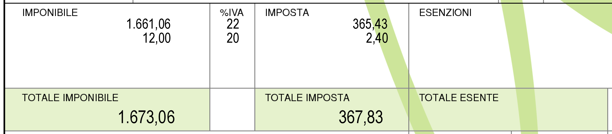

Gli elementi di base
====================

Cos'è la Fattura
----------------
La fattura è un documento emesso da chi vende merce o servizi. Nel rispetto degli accordi commerciali col cliente dà il diritto al venditore di riscuotere il prezzo indicato. La fattura deve avere alcune caratteristiche essenziali previste dalla legge che vedremo in seguito.

Soggetti obbligati all'emissione di fattura
-------------------------------------------
La disciplina relativa alle fattura è contenuta nel Testo Unico IVA (`DPR 633/72`_). All'art.21 viene indicato che deve essere emessa fattura dal soggetto che effettua una operazione in regime di IVA, incluse le operazioni Non Imponibili, Esenti ed in regimi speciali.

Sono previste comunque dalla normativa delle eccezioni per alcune categorie di soggetti e/o per alcune tipologie di operazioni (beni o servizi resi con particolari caratteristiche).

Le categorie dispensate dall'emissione di fattura sono:

- le agenzie di viaggio in regime speciale;
- gli agricoltori ed i pescatori che sono in regime di esonero per i quali l'obbligo deve essere assolto da chi acquista (cessionario) attraverso l'istituto dell'autofattura;
- coloro che sono identificati e sottoposti al regime dei 'contribuenti minimi in franchigia' in vigore dall'1.1.2007;
- le operazioni che rientrano in regimi particolari detti 'monofase' cioè con IVA assolta alla fonte come nel caso dell' editoria, generi di monopolio, ecc.;
- i negozianti con vendita al dettaglio che hanno però altri obblighi come l'emissione dello scontrino fiscale, della ricevuta fiscale e/o la registrazione e trasmissione (anche telematica) dei corrispettivi;

La fattura può essere emessa in forma cartacea od in forma elettronica nel giorno di effettuazione dell'operazione.  E' consentita anche l'emissione di un'unica fattura per tutte le prestazioni o cessioni di beni eseguite nello stesso giorno per lo stesso cliente.

Gli elementi della fattura
--------------------------
Esistono molte tipologie di Fattura. Ognuna si adatta alla tipologia richiesta dall'operazione, ed ognuna presenta gran parte delle caratteristiche in comune con le altre, più alcune peculiarità proprie. Di seguito analizzeremo le caratteristiche comuni a tutte le fatture poi passeremo alle specificità di ogni tipologia.  Una fattura deve contenere alcuni elementi obbligatori previsti dalla normativa; non ci sono obblighi di formato e posizionamento delle informazioni. Per gli esempi ci serviremo del programma `Amica Fatturazione`_.

Elementi obbligatori della fattura
^^^^^^^^^^^^^^^^^^^^^^^^^^^^^^^^^^
1. Generalità del venditore (cedente) complete di Partita IVA

.. image:: images/ElementiFattura1.png

2. Generalità del cliente (cessionario) complete di Partita IVA

.. image:: images/ElementiFattura2.png

3. Numero e data della fattura

.. image:: images/ElementiFattura3.png

4. Descrizione dei beni o dei servizi oggetto del contratto con il cliente

.. image:: images/ElementiFattura4.png

5. Quantità erogate dei beni o dei servizi

.. image:: images/ElementiFattura5.png

6. Prezzo unitario
7. Eventuali sconti applicati
8. Importo complessivo per le quantità cedute per ogni tipologia di bene o servizio
9. Aliquote IVA per ogni tipologia di bene o servizio

10. Eventuali spese accessorie
11. L'annotazione di Imponibile e Imposta per ogni aliquota IVA applicata
12. La descrizione con articolo di legge per ogni eventuale esenzione IVA
13. I totali per Imponibile, Imposta ed Importi Esenti

Elementi facoltativi della fattura
^^^^^^^^^^^^^^^^^^^^^^^^^^^^^^^^^^
Sulla fattura possono essere annotati anche vari elementi contrattuali (facoltativi) come ad esempio:

1. Modalità di pagamento
2. Riferimenti a un eventuale ordine
3. Banca di appoggio per il pagamento
4. Comunicazioni di vario tipo per il cliente (Annotazioni)

Ed ecco il risultato finale, una fattura completa pronta per essere consegnata al cliente:

Determinazione della base imponibile
------------------------------------
Molto importante al fine di realizzare una fattura corretta dal punto di vista fiscale è la determinazione della cosiddetta Base Imponibile: si tratta del valore a cui vengono applicate le imposte (calcolo dell'IVA) nelle varie aliquote.

Riporto un esempio di base per capire meglio come si determina la base imponibile:

+---------------------------------------------+-----------------+ 
| Descrizione                                 | Importo         | 
+=============================================+=================+ 
| Personal Computer                           |          €900,00| 
+---------------------------------------------+-----------------+ 
| Software                                    |          €200,00| 
+---------------------------------------------+-----------------+ 
| Installazione                               |          €100,00| 
+---------------------------------------------+-----------------+ 
| Sconto complessivo 10% (su €1200,00)        |         -€120,00| 
+---------------------------------------------+-----------------+ 
| Imponibile                                  |        €1.080,00| 
+---------------------------------------------+-----------------+ 

Di fatto la base imponibile è il netto sul quale applicare le imposte detratti gli sconti percentuali, gli sconti in valore assoluto e gli eventuali acconti già pagati (e per quali è già stata emessa una fattura con relativa imposta).

Con queste informazioni di base si può realizzare una fattura corretta dal punto di vista formale e fiscale.

Conservazione delle Fatture
---------------------------
La conservazione dei documenti emessi deve essere fatta per 5 anni ai fini tributari; vanno invece conservate 10 anni ai fini civilistici le scritture relative sul giornale di contabilità. Per questioni di prudenza viene di norma consigliata la conservazione per 10 anni anche dei documenti.
I termini di conservazione possono essere prorogati da apposite leggi del parlamento oppure in caso di un accertamento da parte dell'amministrazione finanziaria notificato ma non definito oppure in caso di mancata presentazione del modello Unico ed in vari altri casi particolari.

In caso di utilizzo di sistemi per l'acquisizione ottica, fotografica o altra tecnologia adeguata è possibile non conservare i documenti emessi in originale (cartaceo) a patto di essere in grado di riprodurre a semplice richiesta su carta in qualsiasi istante il documento originale. La normativa sulla conservazione elettronica dei documenti è comunque in continua evoluzione.

Riepilogo
---------
Abbiamo visto cosa è una fattura, chi è tenuto ad emetterla, quali sono gli elementi che la compongono, come si determina la base imponibile e quali sono le regole per la conservazione di questo importante documento fiscale. Sono le conoscenze di base comuni a tutte le tipologie di fattura che bisogna sempre tenere presenti al fine di non commettere errori nella compilazione delle proprie fatture.  A seguire andremo a vedere invece i dettagli delle singole tipologie di documento che possono essere utilizzate.

Domande Frequenti
-----------------
**Domanda** Volevo sapere se le generalità del cliente sono obbligatorie su tutte le pagine della fattura o possono essere stampate solo sull'ultima pagina, come ad esempio il totale fattura, l'imponibile ecc ecc

**Risposta** Le generalità del cliente devono essere riportate in ogni pagina.

**Domanda** Volevo sapere se la fattura deve contenere obbligatoriamente l'intera descrizione del DDT o si può semplicemente riportare il riferimento al documento di trasporto che verrà allegato.

**Risposta** No, non deve contenere l'intera descrizione, basta il riferimento al DDT di consegna.

**Domanda** In termini legali, nel documento occorre specificare se la fattura è immediata o accompagnatoria o differita o basta la dicitura 'fattura'?

**Risposta** Non c'è un obbligo specifico ma è meglio indicarlo, anche se la sola dicitura 'Fattura' è sufficiente ad identificare una fattura immediata.

**Domanda** L'eventuale sconto applicato può essere solo uno sull'importo finale o deve essere specificato per quali beni è applicato?

**Risposta** Puoi applicare uno sconto (anche diverso) per ogni articolo della fattura oppure uno 'generale' valido per tutti gli articoli presenti.

**Domanda** Sulla fattura non è obbligatorio indicare il dato del registro imprese? il numero rea, il capitale eventualmente versato?

**Risposta** Ci sono alcuni dati obbligatori per 'tutti'. Il numero di iscrizione al registro imprese non è obbligatorio per ditte individuali così come per le stesse non esiste un capitale sociale. Di conseguenza l'obbligo di indicare certi dati è conseguente al tipo di impresa e non alla fattura in se. Infatti esistono fatture perfettamente regolari con e senza quei dati come spiegato in questa sezione.

.. _`DPR 633/72`: http://www.normattiva.it/uri-res/N2Ls?urn:nir:stato:decreto.del.presidente.della.repubblica:1972-10-26;633!vig=
.. _`Amica Fatturazione`: http://gestionaleamica.com/Fatturazione
