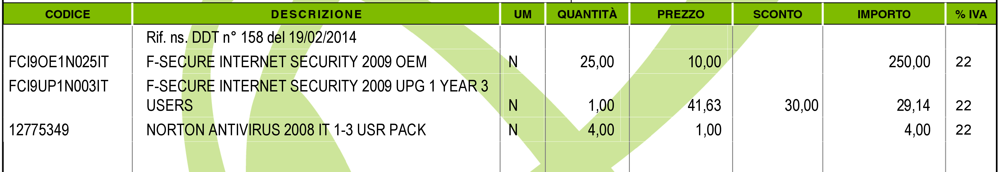
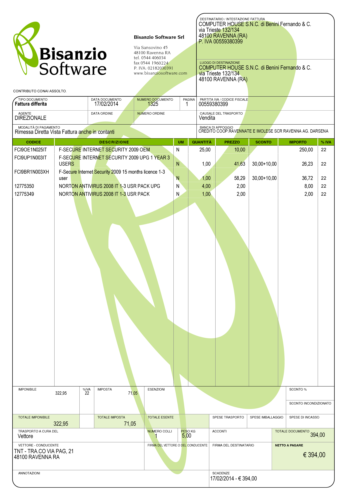

Fattura Immediata, Differita, Accompagnatoria
=============================================
Dopo aver introdotto gli :doc:`Elementi Base della Fattura <elementi>` ed aver visto il :doc:`Documento di Trasporto <ddt>`, in questo capitolo analizziamo le tipologie di fattura più usate: fattura immediata, fattura differita e fattura accompagnatoria. Come al solito per gli esempi ci serviremo del software di fatturazione `Amica Fatturazione`_ che ci permette di emettere tutte le tipologie di fattura possibili e di impostare il modulo di stampa come più ci piace e come meglio si adatta alla nostra categoria merceologica. Successivamente vedremo altre tipologie, come la fattura :doc:`pro-forma <proforma>` e le :doc:`note di credito e debito <variazioni>`. 

.. _immediata:

Fattura Immediata
-----------------
La fattura immediata, come indica il nome stesso, deve essere emessa e consegnata o spedita al cliente, anche a mezzo di sistemi elettronici, entro lo stesso giorno di effettuazione della vendita o prestazione del servizio. Da ciò si evince che la fattura immediata non ha carattere accompagnatorio, per cui i beni/servizi venduti devono poter essere consegnati senza alcun documento. La fattura immediata rappresenta la regola generale ed è il documento di normale uso quando non c'è obbligo di documento di accompagnamento merce.

La fattura per regola viene considerata emessa all'atto della sua consegna o spedizione all'altra parte; non esiste obbligo di verificare la ricezione. L'emissione di fattura immediata per la cessione di beni/servizi consente di evitare il rilascio della :ref:`ricevuta fiscale <ricevuta>` o dello :ref:`scontrino <scontrino>` come previsto dall'articolo 3, comma 2 del DPR 21 dicembre 1996 n° 696. Per avere questo esonero, la fattura deve essere rilasciata contestualmente alla consegna dei beni o all'ultimazione dei servizi, cioè nei termini entro cui sarebbe scattato l'obbligo della certificazione fiscale (scontrino o ricevuta fiscale).

La fattura immediata non ha obblighi aggiuntivi rispetto alle informazioni di base che abbiamo indicato nei capitoli precedenti. Questa tipologia di documento, spesso chiamata anche solo 'Fattura' è il tipo di documento più flessibile e quindi di norma adattabile a tutte le situazioni. 

.. _differita:

Fattura Differita
-----------------
La Fattura Differita è un documento fiscale emesso in un momento diverso da quello dell'effettuazione della prestazione, oppure diverso dalla consegna della merce.

Di norma la Fattura Differita viene utilizzata per la fatturazione a fine mese di merce consegnata con DDT nel corso del mese solare. Questo permette di avere una sola fattura a fronte di molte spedizioni/consegne di merce per il cliente. Si adotta questo sistema quando i propri clienti hanno una frequenza di ordini evasi nel mese abbastanza elevata. Un ottimo esempio può essere un produttore di pane che ogni giorno consegna alle rivendite sue clienti il quantitativo di pane ordinato. Ogni giorno verrà emesso il solo DDT (documento più semplice e senza implicazioni di registrazione nel libro giornale), mentre a fine mese verrà emessa una Fattura Differita riepilogativa del mese appena concluso. Alcuni Gestionali tra cui anche il `Amica Fatturazione`_ consentono di creare le fatture riepilogative di fine mese in modo automatico.

Come regola generale la Fattura Differita può essere emessa solo in riferimento a cessione di beni consegnati con apposito DDT o bolla di accompagnamento (nei casi in cui è ancora prevista) o ricevuta fiscale o scontrino opportunamente integrati con i dati IVA. Quando viene utilizzata come riepilogativa dei DDT raggruppati essa deve contenere l'indicazione di numero e data del documento di trasporto o altro documento con cui è stata consegnata la merce; deve essere emessa e consegnata al cliente entro il giorno 15 del mese successivo a quello dei documenti di riferimento per i documenti di trasporto.

.. _accompagnatoria:

Fattura Accompagnatoria
-----------------------
La fattura accompagnatoria è un documento che possiamo definire ibrido in quanto ha contemporaneamente le caratteristiche e gli obblighi di un DDT e di una Fattura Immediata. Viene emessa quando vi è una cessione di beni che devono essere trasferiti presso il cliente e non può essere utilizzata per fatturare esclusivamente una prestazione di servizi (in quest'ultimo caso è obbligatorio l'uso della fattura immediata).

Vediamone ora un esempio in quanto si tratta del tipo di fattura più complesso, proprio a causa delle sue caratteristiche di duplice valenza.

Essendo una fattura conterrà quindi tutti gli elementi IVA con i relativi riepiloghi per aliquota. Tuttavia, dovendo anche sostituire il DDT, conterrà gli elementi relativi al trasporto come il Vettore, il peso, il numero colli, ecc. Ovviamente gli elementi obbligatori per ognuna delle due tipologie di documenti lo sono anche per la Fattura Accompagnatoria.

Domande Frequenti
-----------------
1. Vorrei chiedervi se sia possibile scorporare un acconto (ho fatto fattura differita per l'acconto), su una fattura accompagnatoria. Cioè, il cliente ha dato l'acconto ed io ho fatto la fattura differita, ora che è arrivata la merce posso fare una fattura accompagnatoria scorporando l'acconto del cliente facendo riferimento al numero della fattura differita?

   **Risposta** Sì è il modo giusto di procedere.

2. Chiedo gentilmente se un'impresa avendo emesso nello stesso mese nel giro di 5 gg. due DDT può alla fine del mese emettere due fatture differite con numerazioni distinte e progressive, oppure se esiste un tipo di contabilità aziendale che permette una cosa così strana.

   **Risposta** Sì non c'è nessun problema la fattura riepilogativa unica a fine mese è un'opzione non un obbligo. Quindi l'azienda può tranquillamente emettere una fattura per ogni DDT o anche una riepilogativa che raggruppa alcuni DDT e un'altra che ne raggruppa altri. A totale discrezione dell'azienda che per motivi interni/gestionali ritiene opportuna una determinata scelta.

Riepilogo
---------
Abbiamo analizzato in questo capitolo le tipologie di fattura usate comunemente nelle aziende sia commerciali che di servizi. Vi invito a porre particolare attenzione alla scelta del tipo di documento corretto sulla base della vostra operatività ed all'uso corretto delle aliquote IVA per i vari prodotti/servizi che vendete. 

.. admonition:: Consiglio

    Poiché anche la fattura come molte altre comunicazioni aziendali
    è rappresentativa della vostra immagine, vi consiglio di curarne in modo
    attento l'aspetto grafico e gli elementi di comunicazione delle
    informazioni. Mi è capitato spesso di vedere aziende con carta intestata
    e logo bellissimi e fatture dall'aspetto poco curato e spesso proprio
    'brutte' da vedere. Di norma non conservo una buona opinione di
    queste aziende. Ricordate che la fattura a volte può essere anche uno
    strumento di marketing per fare attività cosiddetta di 'branding'
    cioè di comunicazione di immagine, prodotti e marchi.

.. _`Amica Fatturazione`: http://gestionaleamica.com/Fatturazione
