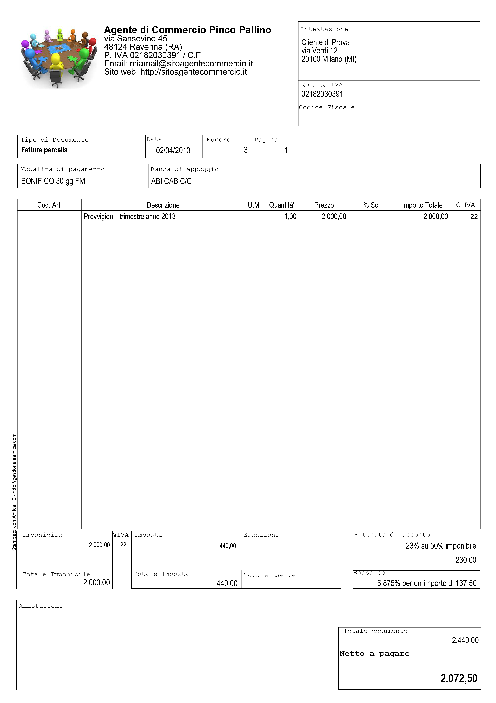

Fatture Professionisti e Parcelle
=================================
La Fattura Professionisti, o Parcella, è il documento fiscale attestante la prestazione di un servizio professionale emesso da un soggetto appartenente a una categoria abilitata allo svolgimento di attività di libera professione.

Soggetti tenuti alla emissione di fatture professionisti e parcelle
-------------------------------------------------------------------
I soggetti interessati alla emissione di questa tipologia di documento sono moltissimi, tutte le figure che abitualmente si definiscono come 'Professionisti'. In queste rientrano tutti quelli dotati di un Albo Professionale come Notai, Avvocati, Architetti, Geometri ecc. e tutti quelli che invece svolgono attività professionale senza essere iscritti ad un apposito Albo come ad esempio consulenti informatici, consulenti marketing, grafici pubblicitari ecc.... Un'altra categoria che emette questo tipo di fattura sono gli Agenti di Commercio.

Terminologia
------------
Per uso comune si utilizza il termine **Parcella** quando si tratta di un professionista iscritto all'Albo che quindi applica le tariffe e le direttive previste, mentre si ricorre al termine **Fattura Professionisti** in tutti gli altri casi, ad eccezione degli Agenti di Commercio, per i quali si usa la dicitura **Fattura Provvigioni**. In ogni caso si tratta di documenti analoghi, con molte caratteristiche comuni ed alcune differenze che vedremo nel dettaglio.

Il professionista ha obbligo di emissione della fattura non al termine della prestazione professionale, ma al momento dell'effettivo pagamento da parte del cliente. Per questo motivo è pratica comune che dopo la prestazione del servizio venga rilasciata una 'fattura proforma'. Di questo di questo particolare documento parleremo in seguito in questa stessa guida.

Caratteristiche principali
--------------------------
Vediamo le principali caratteristiche di una fattura professionisti:

1. Come per tutte le fatture devono essere riportati i dati del Professionista ed i dati completi del Cliente.

2. Nel corpo fattura deve essere descritta correttamente la prestazione svolta

3. Viene sempre applicata la ritenuta d'acconto sull'imponibile

4. Viene calcolato il contributo previdenziale per la cassa di previdenza, che cambia a seconda della categoria professionale a cui appartiene il professionista; quando non c'è una cassa previdenziale specifica viene applicato il contributo INPS.

5. Come in tutte le fatture viene applicata l'IVA o indicata l'eventuale causale di esenzione.

Esempi pratici
--------------
Di seguito analizziamo alcuni casi che sono esemplificativi della maggior parte dei casi reali in cui viene emessa una **Fattura Professionisiti**. Nei casi analizzati sono presenti le principali casistiche anche in relazione alle casse previdenziali specifiche e/o alla gestione separata INPS nonchè all'Enasarco per gli Agenti di Commercio.

L'avvocato
^^^^^^^^^^
Il primo caso preso in esame è una categoria professionale che prevede la cassa previdenziale di categoria al 2% con inclusione di quest'ultima nell'imponibile (l'avvocato, per esempio).
Supponiamo che siano stati offerti servizi per un valore di €1.000,00; a questo dobbiamo aggiungere il contributo cassa di previdenza pari a €20,00 (2%), per un totale imponibile di €1.020,00. Si calcola l'IVA al 22% sull'imponibile, che è pari a €224,40. A questo punto va calcolata al ritenuta di acconto del 20% sull'imponibile della prestazione (esclusa quindi la cassa previdenziale), equivalente a €200,00 (20% di €1.000,00). Come evidenziato dalla tabella sotto il calcolo del netto a pagare, pari a €1.044,40, è presto fatto:

+----------------------------------------------------------------------+------------------------+ 
| Imponibile prestazione                                               |              € 1.000,00| 
+----------------------------------------------------------------------+------------------------+ 
| Contributo Cassa di Previdenza 2%                                    |                 € 20,00| 
+----------------------------------------------------------------------+------------------------+ 
| IVA 22% (su totale imponibile di €1.020,00)                          |                € 224,40| 
+----------------------------------------------------------------------+------------------------+ 
| Ritenuta acconto 20% su imponibile prestazione                       |                € 200,00| 
+----------------------------------------------------------------------+------------------------+ 
| Totale Fattura                                                       |              € 1.244,40| 
+----------------------------------------------------------------------+------------------------+ 
| **Netto a pagare**                                                   |          **€ 1.044,40**|
+----------------------------------------------------------------------+------------------------+ 

.. note::

    il netto a pagare è calcolato come (imponibile prestazione + contributo cassa previdenziale + IVA) - ritenuta di acconto.

Qui sotto vediamo la Fattura dell'Avvocato (parcella) elaborata con l'ausilio di `Amica Fatturazione`_. Trattandosi di un esempio abbiamo scelto un modello di fattura/parcella molto semplice ma completo ed esemplificativo. Naturalmente è possibile personalizzare la stampa secondo le proprio esigenze e preferenze.

Il consulente informatico
^^^^^^^^^^^^^^^^^^^^^^^^^
Il secondo caso preso in esame è una categoria professionale che non prevede la cassa previdenziale di categoria e deve quindi applicare la rivalsa INPS al 4%, con inclusione di quest'ultima sia nel calcolo dell'imponibile sia nel calcolo della Ritenuta di Acconto. Come esempio utilizziamo i consulenti informatici, che rientrano in questa categoria.
Supponiamo che siano stati offerti servizi per un valore di €1.000,00; a questo dobbiamo aggiungere la rivalsa INPS pari a €40,00 (4%), per un totale imponibile di €1.040,00. Si calcola l'IVA al 22% che è pari a €228,80. A questo punto va calcolata al ritenuta di acconto del 20% sul totale imponibile (rivalsa INPS inclusa), pari a €208,00 (20% di €1.040,00). La tabella qui sotto ci aiuta a determinare il netto a pagare, pari a €1.060,80:

+----------------------------------------------------------------------+------------------------+ 
| Imponibile prestazione                                               |              € 1.000,00| 
+----------------------------------------------------------------------+------------------------+ 
| Contributo Cassa di Previdenza 4%                                    |                 € 40,00| 
+----------------------------------------------------------------------+------------------------+ 
| IVA 22% (su totale imponibile di €1.040,00)                          |                € 228,80| 
+----------------------------------------------------------------------+------------------------+ 
| Ritenuta acconto 20% su imponibile prestazione                       |                € 208,00| 
+----------------------------------------------------------------------+------------------------+ 
| Totale Fattura                                                       |              € 1.268,80| 
+----------------------------------------------------------------------+------------------------+ 
| **Netto a pagare**                                                   |          **€ 1.060,80**|
+----------------------------------------------------------------------+------------------------+ 

.. note::

    Il netto a pagare è calcolato come (imponibile prestazione + contributo
    cassa previdenziale + IVA) - ritenuta di acconto.

Anche in questo caso qui sotto vediamo la Fattura del Consulente Informatico (Fattura Professionisti) elaborata con l'ausilio di `Amica Fatturazione`_.

L'agente di commercio
^^^^^^^^^^^^^^^^^^^^^
Il terzo caso è relativo a una categoria professionale speciale, dotata di una casistica sui generis: si tratta degli Agenti di Commercio. In questo caso la Cassa Previdenziale è Enasarco_, e prevede una gestione delle aliquote completamente diversa. Inoltre anche la Ritenuta di acconto si applica solo sul 50% dell'imponibile. Vediamo ora come deve essere compilata una fattura provvigioni corretta.

+----------------------------------------------------------------------+------------------------+ 
| Imponibile prestazione                                               |              € 2.000,00| 
+----------------------------------------------------------------------+------------------------+ 
| IVA 22% (su totale imponibile di € 2.000,00)                         |                € 440,00| 
+----------------------------------------------------------------------+------------------------+ 
| Ritenuta Enasarco al 6,875% (13,75% su 50% dell'imponibile)          |                € 137,50| 
+----------------------------------------------------------------------+------------------------+ 
| Ritenuta acconto (23% su 50% dell'imponibile)                        |                € 230,00| 
+----------------------------------------------------------------------+------------------------+ 
| Totale Fattura                                                       |              € 2.440,00| 
+----------------------------------------------------------------------+------------------------+ 
| **Netto a pagare**                                                   |          **€ 2.072,50**|
+----------------------------------------------------------------------+------------------------+ 

.. note::

    Netto a pagare è calcolato come (imponibile prestazione + IVA - ritenuta
    Enasarco) - ritenuta di acconto. 

Di nuovo vediamo la Fattura Provvigioni dell'agente di commercio elaborata con l'ausilio come sempre di `Amica Fatturazione`_.

Minimali e massimimali Enasarco
^^^^^^^^^^^^^^^^^^^^^^^^^^^^^^^
Per quanto riguarda il contributo Enasarco è importante ricordare l'esistenza dei minimi e massimi. A seconda che l'Agente sia Monomandatario oppure Plurimandatario sono previsti dei minimi e massimi di contribuzione ai quali ditte mandanti e Agenti sono tenuti ad adeguarsi. Fare riferimento al  sito Enasarco per la verifica, in quanto questi valori vengono stabiliti periodicamente dall'Ente stesso. Le pagine `Contributo Minimo (minimale) <http://enasarco.it/Guida/contributo_minimo_annuo_minimale>`_ e `Contributo Massimo (massimale)  <http://enasarco.it/Guida/contributo_massimo_annuo_massimale>`_ consentono di visualizzare le tabelle con i minimi e massimi e di trovare documentazione aggiornata su come effettuare i calcoli.

Riepilogo
---------
Il documento del Professionista per certificare fiscalmente i compensi ricevuti. Attraverso questo documento, oltre agli importi per i servizi e le prestazioni  rese, vengono anche certificate le rivalse per le casse previdenziali previste per legge, vengono aggiunti i recuperi di spese sostenute per conto del cliente (bolli, vidimazioni e altro) e viene evidenziata la ritenuta di acconto che le aziende clienti devono versare come sostituto di imposta.

.. note::

    Porre molta attenzione ai calcoli di IVA e ritenuta di acconto perché,
    a seconda della tipologia professionale, variano, come abbiamo visto negli
    esempi del capitolo.

.. _Enasarco: http://enasarco.it
.. _`Amica Fatturazione`: http://gestionaleamica.com/Fatturazione
