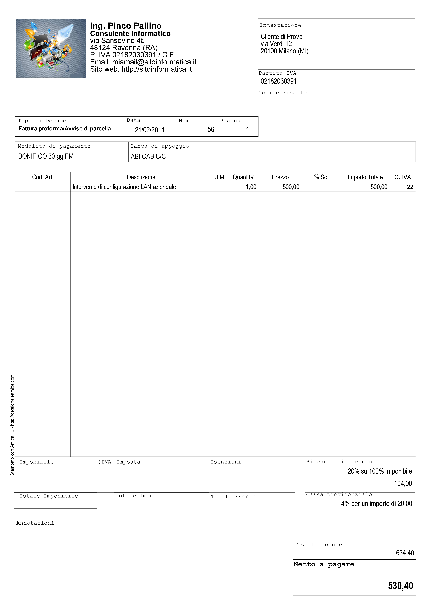
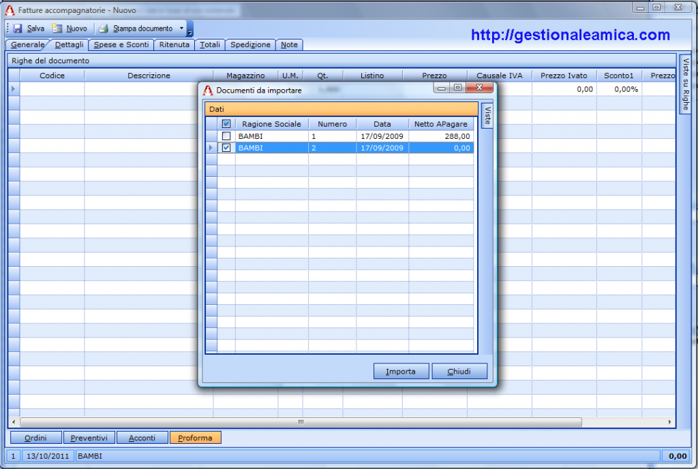

Fattura Pro Forma
=================
La fattura pro forma è un documento senza alcuna valenza fiscale, utilizzato quando si rende necessario presentare al cliente un facsimile della fattura finale senza incorrere negli obblighi fiscali e mantenendo la certezza che il documento non possa far insorgere, in caso di controlli, la presunzione di fatturazione, generando tutte le conseguenze per la mancata registrazione dello stesso.

La fattura pro forma non genera obblighi ai fine della liquidazione IVA e nemmeno al fine della determinazione dei ricavi. Si tratta di un documento in carta semplice che ‘assomiglia’ ad una fattura ma riporta in evidenza la dicitura 'Proforma'. A volte per distinguerla ancora meglio dalla fattura vera e propria si preferisce non mettere il dettaglio dell’IVA, la si presenta un po’ come "il conto da pagare". La mancanza del dettaglio IVA rende la Fattura Proforma sicuramente non assimilabile ad una fattura vera e quindi rende qualsiasi contestazione da parte dell’amministrazione finanziaria  insostenibile. E’ buona regola fare di tutto perché la fattura proforma non sia facilmente assimilabile ad una fattura ordinaria.

Vediamo ora un paio di casi in cui è utile emettere fatture o parcelle pro forma.

Fattura pro forma per il Libero Professionista
----------------------------------------------
I professionisti emettono quasi sempre fattura  pro forma, in quanto hanno l’obbligo di fatturazione non all’esecuzione della prestazione ma solo al pagamento della stessa. Grazie alla pro forma possono presentare la loro parcella al cliente senza doversi accollare gli oneri del pagamento dell’IVA e della tassazione sui ricavi fino al pagamento della stessa. 

Facciamo un esempio per capire meglio: supponiamo che un geometra abbia fatto un progetto di una casa per un importo di €10.000 + IVA ed abbia completato il suo lavoro il 5 Dicembre e che gli accordi con il committente prevedano un pagamento a 60 giorni fine mese dalla consegna lavori. Se il geometra fatturasse il 5 Dicembre si dovrebbe accollare l’IVA da pagare in Gennaio (€2.100) e la tassazione in carico all’anno in corso. Emettendo invece fattura pro forma ed attendendo il pagamento a fine febbraio dell’anno successivo ottiene due vantaggi:

1. l’IVA verrà versata solo a Marzo dell’anno successivo
2. La tassazione sul reddito andrà anch’essa in carico all’anno successivo.

In termini finanziari si tratta di un grande vantaggio offerto al professionista grazie al fatto che la normativa gli permette l'emissione della fattura solo alla data del pagamento.

Fattura pro forma per pagamento anticipato
------------------------------------------
Un altro caso tipico di uso della fattura pro forma si verifica quando si deve spedire della merce ad un cliente che deve pagare con Bonifico Bancario anticipato. In questo caso si compila la fattura pro forma per dare al cliente la possibilità di controllare che i prezzi applicati ed il totale corrispondano perfettamente all’ordine effettuato ed avere un documento di appoggio per l’esecuzione del bonifico; alla spedizione la fattura sarà uguale alla pro forma presentata per il pagamento.

In questo modo l’azienda venditrice si tutela dalla possibilità che il cliente, non effettuando il pagamento, la costringa a stornare la fattura di vendita a mezzo Nota di Credito, aggravando in questo modo gli adempimenti contabili.

Ci sono ovviamente altri casi per l’uso della fattura pro forma, qui abbiamo elencato due dei più diffusi.

Compilazione della fattura pro forma
------------------------------------
Tecnicamente la fattura pro forma è molto simile alla fattura che poi si andrà ad emettere al cliente. Di seguito ne vediamo un esempio realizzato col programma gestionale `Amica 10`_.  Da notare nel riquadro tipo documento la dicitura “fattura pro forma”; assieme alla numerazione che è indipendente da quella delle fatture ordinarie è la vera differenza con la successiva fattura di vendita).

Al momento del pagamento da parte del cliente, o comunque al momento dell’emissione della fattura reale, il gestionale Amica rende l’operazione facile e veloce: è infatti sufficiente richiamare la fattura pro forma in una nuova fattura (ad esempio accompagnatoria) ed il gioco è fatto: la fattura definitiva è pronta senza dover rifare il lavoro. Nell’esempio vediamo quanto sia semplice il processo di importazione:

Riepilogo
---------
Questo è lo strumento che permette al professionista di anticipare al cliente gli importi da pagare ed emettere la fattura vera e propria solo dopo aver incassato quanto richiesto. In questo modo gli obblighi fiscali relativi all’emissione di una fattura, versamento IVA in primis, verranno adempiuti solo dopo aver incassato il denaro dal cliente in modo da non doversi esporre anticipando versamenti di imposte se il cliente non effettuata il pagamento in modo puntuale; è una facoltà concessa dalla legge ai professionisti.

.. admonition:: Consiglio

    Evidenziate bene che si tratta di una fattura proforma (a volte si utilizza
    anche la dicitura preavviso di parcella) per non rischiare di ricadere
    nella presunzione di emissione di fattura con tutti gli adempimenti
    connessi e le relative sanzioni conseguenti.

Domande Frequenti
-----------------
**Domanda** A seguito di un preventivo il cliente ci ha chiesto la fattura pro forma per effettuare il pagamento con bonifico bancario. Poiché la merce devo ordinarla, posso emettere comunque la fattura?

**Risposta** La fattura proforma sì, poichè non ha implicazioni fiscali nemmeno a livello di magazzino. La fattura reale poi verrà emessa solo quando la merce sarà disponibile. E’ buona prassi per non avere un incasso anticipato rispetto all’emissione della fattura autorizzare il bonifico del cliente solo quando la merce è già disponibile. Diversamente se il cliente ti paga prima dovrai emettere una fattura di acconto che chiuderai poi con la fattura che contiene la merce.

**Domanda** Sono un’agente di commercio monomandatario: poiché da qualche mese la società per cui lavoro è in seria difficoltà sta dilazionando sempre più il pagamento delle fatture provvigioni. Ad oggi abbiamo superato i 120 gg. Per limitare i danni sia in termini reddituali che di pagamento IVA posso emettere anche io proforma?

**Risposta** Si lo puoi fare ed emettere poi fattura 'reale' totale o parziale solo al saldo.

**Domanda** Ho una società (snc) e visto che molti clienti faticano a pagare, volevo sapere se anche noi potevamo effettuare delle fatture pro forma, in modo da non dover anticipare l’iva. La ringrazio in anticipo per la risposta..

**Risposta** Dipende da cosa fatturate. Se consegnate merce no, va fatto il DDT e poi la fattura entro i termini di legge. Se invece fate servizi potreste fare la Nota Proforma in attesa del pagamento.

**Domanda** Sono il titolare di una attività commerciale: il proprietario dell’immobile, una s.r.l., da qualche mese ci fa pervenire una fattura pro forma in merito al canone di locazione. Verbalmente abbiamo contestato dicendo che se non emette fattura regolare non paghiamo l’affitto. Può una s.r.l. titolare d’immobile emettere fattura pro-forma e richiedere il pagamento della locazione? Prima i soldi e poi la fattura?

**Risposta** Sì può. L’obbligo ultimo di emissione della fattura è il pagamento, quindi possono emettere la fattura solo quando hanno incassato il corrispettivo.

.. _`Amica 10`: http://gestionaleamica.com
