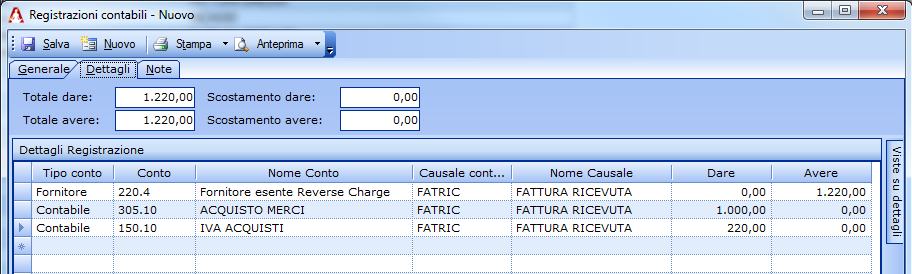
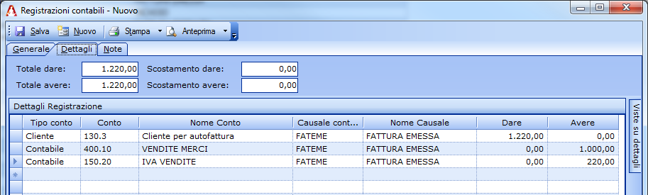

Il Reverse Charge
=================
Il Reverse Charge è un meccanismo che comporta lo spostamento degli obblighi fiscali relativi all'IVA in capo al cessionario e non al cedente come avviene normalmente. L'obiettivo principale della fatturazione Reverse Charge è evitare le frodi IVA nelle quali A emette fattura a B, A incassa l'IVA da B, sparisce e non versa l'imposta (1° danno all'erario). B ignaro di tutto (oppure è consapevole ma fa il finto tonto) va a chiedere il rimborso dell'IVA, il più delle volte riuscendoci (2° danno all'erario).

Dopo aver scoperto numerose frodi di questo tipo, l'erario stabilisce questo principio: siccome di A non mi fido mi scelgo B come debitore dell'imposta nei miei confronti perché lo ritengo più affidabile (di norma il terminale delle operazioni è una società che ha una 'vita' propria ed un mercato reale) e dunque si impone per legge che, per determinate operazioni, si debba applicare il meccanismo del Reverse Charge (art. 17 DPR 633/72). In pratica con tale meccanismo gli obblighi di A vengono 'spostati' in capo a B, che diventerà, dopo la vendita dei prodotti acquistati, il debitore dell'IVA all'Erario.

Applicazione del Reverse Charge
-------------------------------
L'applicazione del Reverse Charge è un meccanismo che progressivamente è stato esteso a molte operazioni che prima erano soggette alla normale disciplina IVA. La prima applicazione è stata la cessione di merci tra aziende di stati membri della Unione Europea fin dall'apertura delle frontiere con l'entrata in vigore del trattato di Schengen nel 1995. Le applicazioni precedenti erano residuali e poco rilevanti. Questi i principali campi di applicazione introdotti successivamente:

- Dal 1°ottobre 2007 per le cessioni di immobili del terziario, con alcune esclusioni, entrano a far parte del meccanismo del Reverse Charge: più avanti in questo libro un approfondimento specifico.
- Dal 1° aprile 2011 sono diventate operative le nuove regole che stabiliscono l'applicazione del meccanismo del Reverse Charge alle le cessioni di telefoni cellulari e microprocessori tra operatori del settore all'interno del territorio nazionale.
- A partire dal 17 marzo 2012 l'applicazione del Reverse Charge è stato esteso anche alle prestazioni di servizi generiche da parte di fornitori UE ad imprese italiane ed analogamente da parte di imprese italiane a clienti UE: prima era regolamentata con il Reverse Charge solo la cessione di beni.

Come Fatturare col Reverse Charge
---------------------------------
Una fattura gestita secondo le regole del Reverse Charge deve essere registrata secondo lo schema che vado a proporre e spiegare:

1. Si integra la fattura con l'esposizione dell'IVA.
2. Si registra la fattura nel registro acquisti.
3. Si registra l'autofattura ex art. 17 c. 6 DPR 633/72 nel registro vendite per rendere l'operazione neutra ai fini IVA. E' un movimento che deve avvenire solo ai fini IVA ma non ai fini del reddito. In questo modo gli obblighi IVA sono stati 'invertiti' a carico dell'acquirente così come richiede la normativa vigente.

Operativamente bisogna creare nel gestionale un apposito codice IVA analogo a quello utilizzato per registrare gli acquisti intracomunitari ed un conto transitorio dove far transitare le registrazioni.

**Nota bene:** l'esempio si riferisce al Gestionale Amica ma è valido anche se usi un altro gestionale o se si fanno registrazioni a mano.

Esempio di fatturazione col Reverse Charge
------------------------------------------
Una fattura da € 1.000 con codice di esenzione art. 17 va registrata con tre scritture contabili:

Registrazione di Acquisto
^^^^^^^^^^^^^^^^^^^^^^^^^
- Fornitore in Avere per €1220 (il valore della fattura + IVA al 22%)
- Costo in Dare € 1000 (il valore della fattura)
- IVA Acquisti in Dare €220 (IVA calcolata sul valore della fattura)
- Castelletto IVA come per una normale fattura di acquisto.

 
Registrazione di Vendita
^^^^^^^^^^^^^^^^^^^^^^^^
- Ricavi in Avere €1000 (valore della fattura)
- Cliente (se stessi per autofattura) in Dare €1220 (valore della fattura + IVA al 22%)
- IVA Vendite in Avere €220 (IVA calcolata sul valore della fattura)
- Castelletto IVA come per una normale fattura di vendita.

Registrazione Contabile
^^^^^^^^^^^^^^^^^^^^^^^
- Fornitore in Dare €220 (valore dell'IVA al 22%)
- Cliente (se stessi per autofattura) in Avere €1220 (il valore della fattura con IVA)
- Ricavi in Dare €1000 (Storno ricavo della registrazione n. 2)
- Nessun castelletto IVA
 

L'inversione contabile (obiettivo della legge) si realizza con l'emissione dell'autofattura perché in tal modo è il destinatario finale a corrispondere l'IVA all'Erario anziché il fornitore. Se non ci fosse stato Reverse Charge ci sarebbe stata una fattura con IVA e sarebbe stata pagata al fornitore: l'azienda l'avrebbe portata in detrazione ed il Fornitore l'avrebbe versata all'Erario; siccome è stato applicato il Reverse Charge entrambe le operazioni le fa il destinatario della merce: prima si porta l'IVA in detrazione con la fattura integrata e poi la si porta a debito con l'autofattura. Il risultato finale di tutto questo è che, avendo neutralizzato l'iva in acquisto, verrà versato l'intero ammontare dell'iva sulla vendita.

Reverse Charge in campo Immobiliare
-----------------------------------
Dal 1°ottobre 2007 le cessioni di immobili per il settore terziario sono soggette al regime del Reverse Charge, con alcune esclusioni come vedremo più avanti.

Le operazioni soggette al regime del Reverse Charge in campo immobiliare sono:

- le vendite di immobili del terziario;
- le vendite per le quali il cedente ha espressamente indicato nell'atto di compravendita l'opzione per l'imposizione ai fini IVA;

Sono invece escluse dall'ambito di applicazione del Reverse Charge, e quindi dovranno continuare ad essere fatturate con IVA le seguenti operazioni:

- le vendite di immobili terziario nuove (ceduti entro 4 anni dall'ultimazione della costruzione o della ristrutturazione);
- le vendite di immobili terziario a persone fisiche;
- le vendite di immobili terziario a soggetti con detraibilità IVA inferiore al 25% come ad esempio banche, assicurazioni, società finanziarie, società immobiliari con patrimoni residenziali ecc…
- le vendite di aree edificabili;
- le vendite di aree non edificabili;
- le vendite di immobili abitativi;
- gli apporti a fondi immobiliari di una pluralità di immobili prevalentemente locati.

Registrazioni da effettuare
^^^^^^^^^^^^^^^^^^^^^^^^^^^
Vediamo adesso in pratica come si devono comportare dal punto di vista dei documenti fiscali e della loro registrazione i due soggetti coinvolti. Il Venditore (cedente) e l'acquirente (cessionario).

**VENDITORE**

Il venditore deve emettere la fattura senza l'applicazione dell'IVA, indicando la dicitura che la definisce soggetta al Reverse Charge: 'operazione non soggetta ad IVA ai sensi dell'art. 17, comma 5 del D.P.R. n. 633 del 1972'.

**Vantaggio:** il Venditore non sarà debitore d'imposta e pertanto non dovrà procedere al versamento dell'IVA.

**ACQUIRENTE**

L'acquirente dell'immobile, come sempre con l'applicazione di Reverse Charge, dovrà integrare la fattura con l'indicazione dell'aliquota IVA e della relativa imposta, registrare il documento integrato nel registro IVA delle fatture emesse indicando l'IVA integrata a debito, ed effettuare la stessa registrazione nel registro Acquisti ponendo l'IVA a credito.

**Vantaggio:** l'acquirente non dovrà più pagare l'IVA in fase di acquisto e quindi non dovrà più finanziare l'IVA con un conseguente risparmio di oneri finanziari in caso di mutuo o finanziamento.

Riepilogo
---------
Abbiamo terminato questo complesso argomento cercando di spiegare in modo semplice ma completo come funziona, con anche cenni dal punto di vista puramente contabile; dovreste adesso essere in grado di completare tutti gli adempimenti necessari, dall'integrazione dell'iva sulla fattura del fornitore all'emissione dell'autofattura.

Domande Frequenti
-----------------
**Domanda** Ma in caso di acquisto in paesi IntraCee è obbligatori registrare la fattura in regime di reverse charge?
E se cosi fosse l'importo IVA deve risultare sui registri Acquisti Vendite ??

**Risposta** Le fatture ricevuta da soggetti IntraCEE devono essere trattate con la procedura contabile del Reverse Charge, nella quale l'IVA compare sia sul registro Acquisti che sul registro Vendite. Solitamente per le operazioni IntraCEE si utilizzano due registri appositi denominati AcquistiCEE e VenditeCEE.

**Domanda** Ho un negozio di cellulari appena aperto. Acquisto i telefonini con il metodo del reverse charge.
Li rivendo ai privati con IVA come mi ha detto il commercialista. Ma quando dovrò pagare trimestralmente l'IVA verrà una cifra altissima non potendo scaricare nulla. E' giusto il ragionamento?

**Risposta** Certo, il Reverse Charge serve proprio a questo, a portate l'onere dell'IVA in carico al rivenditore al dettaglio. Non acquistando con IVA il tuo 'fornitore' non può evaderla e tu non la detrai. In questo modo si evitano le truffe sull'IVA e l'Erario è sempre in grado di tracciarla e di conseguenza di incassarla. E' vero che non detrai l'IVA ma non l'hai nemmeno pagata al fornitore.

**Domanda** Se presto un servizio a un'azienda intracomunitaria, semplicemente devo fatturare senza IVA ma contabilmente non devo fare nulla giusto (non io ma il mio commercialista ovviamente.

**Risposta** Giusto. Sarà poi chi riceve la fattura nel paese UE che dovrà fare gli adempimenti previsti dalla legislazione del suo paese: mi risulta che ormai per tutti i paesi UE venga applicato il Reverse Charge. Tu dovrai fare la fattura mettendo i riferimenti dell'esenzione e la dicitura Reverse Charge.

**Domanda** Se ad esempio a fine anno ho speso con AdWords 10.000 euro che ricevo con fattura senza IVA in quanto intrastat ed ho un fatturato lordo di 20.000+IVA, pagheró quindi le tasse sull'utile di 10.000€ mentre per quanto riguarda l'iva mi toccherà versare tutta l'iva dei 20.000, ovvero 4.400 quanto come spesa in detrazione non ce l'ho oppure verserò l'iva solo sulla differenza fatturato lordo- spese quindi solo su 10.000?

**Risposta** L'IVA da versare sarà quella che si rileva dalla somma dell'imposta applicata nelle fatture quindi 4.400 Eur come dici giustamente. Ricorda che non detrai l'iva perché al fornitore non l'hai pagata qiomdi in termini complessivi nulla cambia. Se il fornitore ti avesse fatturato il servizio + IVA avresti pagato a lui 12.200 euro (2.200 di IVA) poi avresti versati all'Erario solo 2.200 (4.400 a debito; 2.200 a credito). Risultato identico.

**Domanda** Avrei una domanda sul discorso reverse change in ambito telefonia. Rivendo cellulari acquistandoli in reverse change dove se li vendo a privati devo giustamente applicare l'iva e qua ci siamo. Nel caso li vendessi a titolari di partita IVA posso non applicare l'iva. La mia domanda è la seguente: in quest'ultimo caso di vendita, l'aquirente con partita IVA deve essere un rivenditore oppure potrebbe semplicemente acquistare il cellulare per utilizzo proprio avendolo così ad un prezzo agevolato?

**Risposta** L'esenzione IVA non può essere applicata se il destinatario del bene è l'utilizzatore finale. Quindi anche il titolare di partita IVA se utilizzatore finale dovrà ricevere da te fattura normale con IVA. L'esenzione per Reverse Charge va applicata sol se la vendita è fatta ad altro rivenditore/distributore che userà il bene per la rivendita. In ogni caso non avrà alcun prezzo agevolato, il Reverse Charge non cambia la sostanza economica del prezzo.

**Domanda** Sono un commerciante di cellulari e volevo dei chiarimenti. Se io acquisto un cellulare da un rivenditore ad € 100, fatturato in Reverse Charge, e lo vendo ad € 130 al cliente finale, andrò a pagare 28,60 € di IVA, quindi andrò a guadagnare ((130-28,60)-100)= 1,40 €. E' corretto il ragionamento?

**Risposta** Se ho capito bene i valori che segnali, vendi il cellulare a 130 euro IVA inclusa giusto? Se è così, scorporando l'IVA il valore imponibile della vendita è di 106,56 mentre il valore dell'IVA è di 23,44. Il tuo guadagno sarà quindi pari a 6,56 euro. Nei tuoi calcoli hai calcolato l'IVA su 130 eur e non hai invece applicato lo scorporo quindi poi tutto il ragionamento è sbagliato.

**Domanda** Nel caso in cui io dovessi una nota di credito dal mio fornitore senza IVA con art. 17, mi ritrovo a dover integrare l'iva come faccio per le fatture acquisto?

**Risposta** Certo, va trattata esattamente allo stesso modo, ovviamente a valori IVA 'invertiti' negli appositi registri.

**Domanda** Sono un praticante commercialista che si sta cimentando per la prima volta con il metodo del Reverse Charge. Le faccio innanzitutto i miei complimenti sulla sua grande esperienza e le pongo questo quesito: ho una fattura da un fornitore tedesco di 29,95€ , composta da un imponibile di 25,17 ed IVA di 4,78 (19%). Tale ammontare è stato sicuramente scaturito dalla mancata iscrizione al Vies ed alla mancata comunicazione del mio cliente. Allora in questo caso:

1) L'Iva la imputero' a costo, giusto?
2) Nella documentazione cartacea devo fare una fotocopia della fattura acquisti e porla nelle fatture emesse applicando il reverse charge?
3) Ultima domanda, una volta effettuato il R.C., faro' l'intrastat e terminero' finalmente l'operazione?

**Risposta** Con Risoluzione 27 aprile 2012 n. 42, l'Agenzia delle Entrate ha chiarito alcune questioni inerenti la qualificazione giuridica delle operazioni effettuate da un soggetto passivo stabilito in Italia non regolarmente iscritto al VIES. In particolare è stato affermato che, senza iscrizione al VIES, l'acquisto effettuato da una società italiana presso un'azienda con sede in un altro stato UE, non deve essere considerato una operazione intracomunitaria e pertanto l'IVA non è dovuta in Italia ma nel Paese del fornitore. Dal punto di vista procedurale, quindi, l'acquirente italiano non deve provvedere alla doppia annotazione della fattura nel registro delle fatture emesse e nel registro acquisti non essendo applicabile il meccanismo dell'inversione contabile e quindi non adempiere nemmeno a tutti gli adempimenti per le fatture INTRA.

**Domanda** Vorrei sapere se gli acquisti di servizi da paesi extracee devo integrarli con l'Iva con questo sistema del Reverse-Charge. Noi lo stiamo facendo però l'autofattura non la facciamo a noi stessi ma registriamo una 'vendita' allo stesso fornitore per annullare l'Iva inserita in fattura. E' sbagliato?

**Risposta** Non mi risulta si possa fare, dovete fare autofattura come previsto dalla normativa. Non ho mai sentito nessuno che faceva fattura al fornitore. Anche se da un punto di vista sostanziale tutto torna, dal punto di vista formale certo no. Ad esempio, la fattura che fate al fornitore gliela mandate? Questo ad esempio è un problema, potrebbe essere considerata una fatturazione 'fittizia' in quanto la controparte non viene messa al corrente che si è emessa una fattura nei loro confronti.

**Domanda** Avrei bisogno di un chiarimento: il mio compagno ha un negozio di cellulari, acquista i cellulari con fattura senza IVA per effetto del Reverse Charge. Quando rivende a clienti con partita IVA emette fattura con IVA al 22%, il dubbio mi è sorto ora che si trova a rivendere i cellulari ad altri negozi di cellulari, come dobbiamo comportarci? Fatturare con IVA o applicare il Reverse Charge? Il consulente suggerisce di fatturare con IVA ma non sono molto convinta.

**Risposta** No assolutamente. Se vengono venduti a fine di rivendita (a negozi che li rivenderanno) va applicato il Reverse Charge. Diversamente il motivo per cui è stato imposto l'obbligo decade (che è evitare le frodi IVA) e voi eludete la normativa che impone di fatturare in Reverse Charge se il cliente è un operatore che rivenderà il prodotto.

