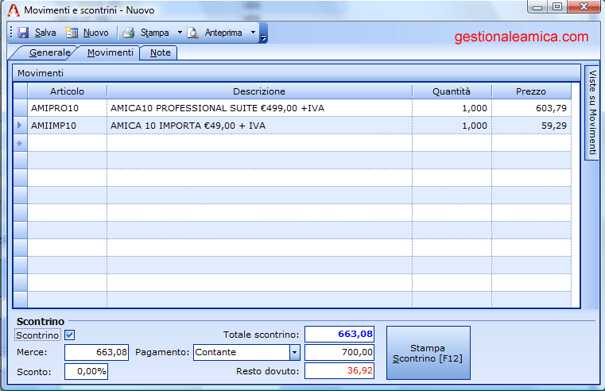
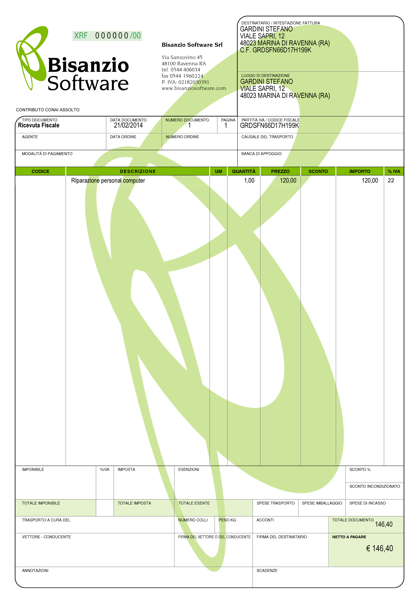

Ricevuta Fiscale e Scontrino Fiscale
====================================
In questo capitolo parliamo di Ricevuta Fiscale e Scontrino Fiscale e vediamo cosa sono, quando vanno emessi e chi è tenuto ad emetterli.

Ricevuta Fiscale e Scontrino Fiscale: obbligo generalizzato
-----------------------------------------------------------
Per la normativa italiana tutti i soggetti non obbligati all'emissione di fattura devono rilasciare Ricevuta Fiscale oppure Scontrino Fiscale. Questi soggetti sono obbligati all'emissione di fattura solo se richiesta preventivamente dal cliente come disposto dall'art. 12 comma 1 L. 413/91.

Soggetti tenuti alla emissione di ricevuta fiscale/scontrino
^^^^^^^^^^^^^^^^^^^^^^^^^^^^^^^^^^^^^^^^^^^^^^^^^^^^^^^^^^^^
I principali soggetti non obbligati all'emissione della fattura, se non richiesta preventivamente dal cliente, sono indicati nell'art. 22 del `DPR 633/72`_:

- Commercianti con autorizzazione di vendita al dettaglio;
- Artigiani che vendono beni di propria produzione presso i laboratori (CM 32/501388-1973);
- Soggetti che forniscono prestazioni alberghiere;
- Soggetti che forniscono prestazioni di somministrazione di alimenti e bevande;
- Imprese che prestano servizi in locali aperti al pubblico;
- Imprese che prestano servizi nell'abitazione dei clienti o in forma ambulante;
- Imprese che effettuano trasporti di persone, veicoli e bagagli al seguito;
- Istituti di credito per servizi di custodia di titoli e altri servizi;
- Soggetti che effettuano talune operazioni esenti (assicurazioni, finanziamenti, affitti e locazioni.

Facendo un esempio: lo scontrino viene emesso dal panettiere che vende il pane (bene) nel proprio esercizio commerciale, la ricevuta viene emessa da una lavanderia alla consegna del capo lavato (servizio). Come linea generale (ma può essere derogata) lo scontrino viene emesso dagli esercizi commerciali per la vendita di beni, la ricevuta fiscale viene invece emessa dagli artigiani (o assimilabili) per la prestazione di un servizio.

L'art. 2 e del DPR 696/1996 ha stabilito che dal 21.02.1997 non è più obbligatoria l'emissione di scontrino o di ricevuta fiscale se viene emessa fattura immediata, oppure in presenza di DDT o documenti di consegna idonei che permettano la fatturazione differita integrati con il corrispettivo dell'operazione.

.. _scontrino:

Scontrino Fiscale
-----------------
L'imprenditore può liberamente scegliere tra l'emissione dello scontrino e l'emissione della ricevuta, utilizzando l'uno o l'altra anche nello stesso anno fiscale senza alcun problema. Qualora scelga lo scontrino vediamo quali sono le caratteristiche; uno scontrino corretto deve contenere:

1. denominazione/ragione sociale di chi lo emette;
2. indirizzo del punto vendita;
3. partita IVA;
4. dati contabili dell'operazione come corrispettivi, rimborsi, totale ecc.;
5. data, ora di emissione, numero progressivo;
6. logotipo fiscale e numero di matricola del registratore.

Lo scontrino deve essere emesso quando si consegna la merce, quando si completa la prestazione o quando si incassa il corrispettivo. Di norma lo scontrino può essere digitato manualmente sul Registratore di Cassa oppure realizzato automaticamente con il collegamento a lettori di codice a barre e/o programmi gestionali che integrino le funzioni per l'emissione di scontrini. Nel programma `Amica 10`_ è possibile compilare gli scontrini in un'apposita finestra, anche attraverso lettore di codice a barre, e poi procedere alla memorizzazione per lo scarico del magazzino. Collegando un registratore di cassa fiscalizzato è anche possibile stampare direttamente lo scontrino. Qui sotto la finestra di emissione scontrini di `Amica 10`_.

Sanzioni per mancata emissione di scontrino fiscale
^^^^^^^^^^^^^^^^^^^^^^^^^^^^^^^^^^^^^^^^^^^^^^^^^^^
Nell'ottica di una più efficace lotta all'evasione fiscale, negli ultimi anni sono state inasprite le sanzioni per la mancata emissione di scontrino fiscale ed in particolare è stata prevista anche la possibilità di sospensione temporanea dell'attività, misura molto pesante perchè impatta direttamente sul reddito dell'attività del commerciante. Vediamo ora in dettaglio le sanzione relative alla mancata emissione di scontrino fiscale.

**Sanzione amministrativa:** la mancata emissione di scontrino fiscale configura un tentativo di evasione fiscale; la sanzione prevista ammonta al versamento del 100% dell'imposta evasa calcolata sul valore del prezzo di cessione del bene o servizio venduto e comunque non è mai inferiore a 516 euro. quindi di norma per scontrini di importo non particolarmente elevato la sanzione ammonta a 516 euro.

**Sospensione dell'attività:** si tratta di una 'sanzione accessoria' che viene prevista in aggiunta alla sanzione amministrativa per i casi di reiterazione e consiste nella chiusura del negozio o laboratorio per un periodo variabile da 3 a 30 giorni consecutivi. La sospensione scatta dopo che viene accertata la mancata emissione di 4 scontrini nell'arco di 5 anni.

**NOTA BENE:** la normativa parla di 4 scontrini e non di 4 verifiche, per cui basta non emettere 4 scontrini rilevati da ispettori in borghese nell'ambito della stessa verifica per incorrere nella sanzione accessoria.

.. _ricevuta:

Ricevuta Fiscale
----------------
La ricevuta fiscale deve essere emessa in duplice esemplare utilizzando modelli sostanzialmente conformi a quello approvato con DM 30.03.1992. La ricevuta fiscale deve contenere i seguenti dati:

1. la numerazione progressiva attribuita per anno solare;
2. la numerazione 'fiscale' attribuita dalla tipografia autorizzata alla stampa ed i riferimenti alla relativa autorizzazione;
3. la data di emissione;
4. ragione sociale, sede legale, partita IVA ed indirizzo commerciale di chi la emette;
5. descrizione dei beni o servizi, quantità, corrispettivi comprensivi di IVA,

Sotto vediamo un Fac-Simile di ricevuta fatta con il programma `Amica Fatturazione`_:

Basta una rapida occhiata per rendersi conto che la ricevuta fiscale è un documento molto simile alla fattura, con i prezzi indicati IVA inclusa.

Aspetti civilistici
^^^^^^^^^^^^^^^^^^^
Sia lo scontrino che la ricevuta fiscale, oltre ad adempiere ai doveri fiscali del contribuente, rappresentano anche il documento che permette di far valere, ai fini civilistici, gli obblighi e gli accordi contrattuali, come ad esempio la decorrenza della garanzia su prodotti acquistati oppure la garanzia su qualità e durata di interventi tecnici di riparazione, oppure ancora certificare la data in cui si avvia un servizio con durata predefinita (ad esempio un abbonamento).

Domande Frequenti
-----------------
1. Vorrei chiarimenti in merito alla corretta intestazione degli scontrini fiscali rilasciati dai venditori ambulanti. In particolar modo se è obbligatorio l'indirizzo/domicilio fiscale o se basta la ragione sociale e la partita IVA e luogo di riferimento della camera di commercio della società

   **Risposta** L'articolo 17, comma 2 del Decreto ministeriale 30.3.92, per quanto riguarda gli scontrini emessi con gli apparecchi per il commercio ambulante prevede che l'indirizzo dell'esercizio (che non esiste) sia sostituito dal numero di iscrizione al REC e la città sede della competente CCIAA. In seguito il D. Lgs. 31.3.98 n. 114, ha soppresso anche il numero REC.

2. Mi occorre sapere cosa significa la parola esente scritta su scontrino fiscale emesso da una libreria per acquisto di testo scolastico.

   **Risposta** Probabilmente intendono esente da IVA. In realtà l'IVA c'è ma è assolta alla fonte dall'Editore quindi la libreria emette scontrino senza IVA.

3. Volevo sapere se è possibile emettere ricevute fiscali direttamente da un software senza avere un  registratore di cassa o i fogli preventivamente numerati da tipografie autorizzate. L'agenzia delle entrate può rilasciare l'autorizzazione direttamente ad un commerciante per l'emissione delle ricevute fiscali?

   **Risposta** No l'Agenzia Entrate rilascia l'autorizzazione a soggetti che le preparano e stampano in conto terzi. Se vuoi stampare ricevute fiscali con un tuo software dovrai dotarti di moduli con numero prestampato da intermediario abilitato (tipografie abilitate).

4. Mi è capitato di richiedere una ricevuta fiscale e quindi ho comunicato i miei dati societari che sono stati immessi nel software gestionale del bar-ristorante. Il risultato è stato vedermi venir fuori dalla stesso hardware che stampa scontrini la ricevuta fiscale. Stesso formato identico in tutto e per tutto allo scontrino con la differenza di avere i miei dati riportarti ma senza il numero progressivo assegnato da una tipografia autorizzata , ma semplicemente prendendo come numerazione quella progressiva degli scontrini. E' possibile tutto ciò?

   **Risposta** Sì, è il misuratore fiscale che sostituisce la numerazione prestampata.

5. Salve, come funziona la numerazione degli scontrini nel caso ci siano più casse, caso dei supermercati o grosse catene della ristorazione? Il numero è specifico di quella cassa?

   **Risposta** Sì, ogni cassa ha la sua numerazione da 1 in poi per gli scontrini per ogni giornata.

6. Ho una profumeria e ho dei prodotti in conto vendita. Devo emettere scontrino fiscale per questi prodotti o segnarli solamente sull'apposito registro?

   **Risposta** Devi emettere scontrino fiscale regolarmente, dal tuo punto di vista è una vendita a tutti gli effetti.

7. Chiedo gentilmente un'informazione: nel ns. negozio utilizziamo le ricevute fiscali autoricalcanti in duplice copia di Buffetti, l'ultimo blocchetto dispone ancora di 20 ricevute da utilizzare. Considerato che è iniziato l'anno nuovo, devo utilizzare un nuovo blocchetto partendo dal numero 1 oppure posso utilizzare il blocchetto in uso sempre inserendo la nuova numerazione?

   **Risposta** Puoi, anzi devi, utilizzare tutte le ricevute in tuo possesso quindi prosegui tranquillamente con il blocchetto ripartendo dalla N 1.

8. Ho un dubbio: dovendo emettere delle ricevute fiscali da due punti vendita differenti ma intestati alla medesima società, si possono utilizzare contemporaneamente due blocchetti di ricevute fiscali?

   **Risposta** Sì senza problemi. Ti consiglio di usare due numerazioni delle ricevute per i due punti vendita tipo 1/A e 1/B rispettivamente per il negozio 1 e per il negozio 2.

9. Volevo sapere se è obbligatorio il rilascio della ricevuta fiscale al cliente in originale grazie

   **Risposta** La risposta è sì, l'originale va sempre al cliente.

10. A causa di un errore del PC è stata stampata una ricevuta fiscale sbagliata. Ho annullato il documento dal software e dopo aver riavviato il programma ho emesso nuovamente un documento. Questa nuova ricevuta ha lo stesso identico numero progressivo, ma ovviamente cambia il numero prestampato (quello con /12 per intenderci). E' un problema? Cosa succede? Come posso provvedere?

   **Risposta** Basta scrivere chiaramente sulla ricevuta da annullare che è annullata e conservare tutte le copie come gli altri documenti fiscali.

Riepilogo
---------
Lo Scontrino Fiscale e la Ricevuta Fiscale sono i due documenti di certificazione degli incassi da soggetti senza partita IVA per i commercianti al dettaglio (scontrino) e per gli artigiani (ricevuta fiscale).  Il commerciante dovrà dotarsi di Registratore di Cassa mentre l'artigiano di Ricevute Fiscali con il numero progressivo prestampato.

.. _`Amica 10`: http://gestionaleamica.com
.. _`DPR 633/72`: http://www.normattiva.it/uri-res/N2Ls?urn:nir:stato:decreto.del.presidente.della.repubblica:1972-10-26;633!vig=
.. _`Amica Fatturazione`: http://gestionaleamica.com/Software/Fatturazione
