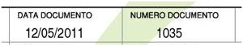

============
Introduzione
============
Questa Guida Alle Fatture è dedicata ai principianti che vogliono saperne di più sulla Fattura in tutte le sue forme: cosa è, quali tipologie esistono, come è composta e, naturalmente, come si compila. Nel corso della guida passeremo in rassegna tutti i documenti di fatturazione esistenti: immediata, differita, accompagnatoria, proforma, parcella, ddt, ricevuta fiscale, autofattura, nota di variazione (credito o debito). Partiremo dalle caratteristiche comuni a tutti questi documenti per poi scendere nel dettaglio, esaminando le peculiarità di ognuna di esse.

Non mancheranno argomenti più avanzati, come le regole per gli arrotondamenti. Se siete interessati ad ulteriori approfondimenti non scordate di iscrivervi alla Newsletter_, così da non perdervi i futuri articoli sull'argomento, pubblicati anche sul nostro seguitissimo Blog_.

********************
Gli elementi di base
********************
Cos'è la Fattura
----------------
La fattura è un documento emesso da chi vende merce o servizi. Nel rispetto degli accordi commerciali col cliente dà il diritto al venditore di riscuotere il prezzo indicato. La fattura deve avere alcune caratteristiche essenziali previste dalla legge che vedremo in seguito.

Soggetti obbligati all'emissione di fattura
-------------------------------------------
La disciplina relativa alle fattura è contenuta nel Testo Unico IVA (`DPR 633/72`_). All’art.21 viene indicato che deve essere emessa fattura dal soggetto che effettua una operazione in regime di IVA, incluse le operazioni Non Imponibili, Esenti ed in regimi speciali.

Sono previste comunque dalla normativa delle eccezioni per alcune categorie di soggetti e/o per alcune tipologie di operazioni (beni o servizi resi con particolari caratteristiche).

Le categorie dispensate dall’emissione di fattura sono:

- le agenzie di viaggio in regime speciale;
- gli agricoltori ed i pescatori che sono in regime di esonero per i quali l’obbligo deve essere assolto da chi acquista (cessionario) attraverso l’istituto dell’autofattura;
- coloro che sono identificati e sottoposti al regime dei 'contribuenti minimi in franchigia' in vigore dall’1.1.2007;
- le operazioni che rientrano in regimi particolari detti ‘monofase’ cioè con IVA assolta alla fonte come nel caso dell’ editoria, generi di monopolio, ecc.;
- i negozianti con vendita al dettaglio che hanno però altri obblighi come l’emissione dello scontrino fiscale, della ricevuta fiscale e/o la registrazione e trasmissione (anche telematica) dei corrispettivi;

La fattura può essere emessa in forma cartacea od in forma elettronica nel giorno di effettuazione dell’operazione.  E’ consentita anche l’emissione di un’unica fattura per tutte le prestazioni o cessioni di beni eseguite nello stesso giorno per lo stesso cliente.

Gli elementi della fattura
--------------------------
Esistono molte tipologie di Fattura. Ognuna si adatta alla tipologia richiesta dall’operazione, ed ognuna presenta gran parte delle caratteristiche in comune con le altre, più alcune peculiarità proprie. Di seguito analizzeremo le caratteristiche comuni a tutte le fatture poi passeremo alle specificità di ogni tipologia.  Una fattura deve contenere alcuni elementi obbligatori previsti dalla normativa; non ci sono obblighi di formato e posizionamento delle informazioni. Per gli esempi ci serviremo del programma `Amica Fatturazione`_.

Elementi obbligatori della fattura
^^^^^^^^^^^^^^^^^^^^^^^^^^^^^^^^^^
1. Generalità del venditore (cedente) complete di Partita IVA

.. image:: img/ElementiFattura1.png

2. Generalità del cliente (cessionario) complete di Partita IVA

.. image:: img/ElementiFattura2.png

3. Numero e data della fattura

.. image:: img/ElementiFattura3.png

4. Descrizione dei beni o dei servizi oggetto del contratto con il cliente

.. image:: img/ElementiFattura4.png

5. Quantità erogate dei beni o dei servizi

.. image:: img/ElementiFattura5.png

6. Prezzo unitario
7. Eventuali sconti applicati
8. Importo complessivo per le quantità cedute per ogni tipologia di bene o servizio
9. Aliquote IVA per ogni tipologia di bene o servizio

.. image:: img/ElementiFattura6.png

10. Eventuali spese accessorie
11. L’annotazione di Imponibile e Imposta per ogni aliquota IVA applicata
12. La descrizione con articolo di legge per ogni eventuale esenzione IVA
13. I totali per Imponibile, Imposta ed Importi Esenti

Elementi facoltativi della fattura
^^^^^^^^^^^^^^^^^^^^^^^^^^^^^^^^^^
Sulla fattura possono essere annotati anche vari elementi contrattuali (facoltativi) come ad esempio:

1. Modalità di pagamento
2. Riferimenti a un eventuale ordine
3. Banca di appoggio per il pagamento
4. Comunicazioni di vario tipo per il cliente (Annotazioni)

Ed ecco il risultato finale, una fattura completa pronta per essere consegnata al cliente:

.. image:: img/ElementiFattura8.png

Determinazione della base imponibile
------------------------------------
Molto importante al fine di realizzare una fattura corretta dal punto di vista fiscale è la determinazione della cosiddetta Base Imponibile: si tratta del valore a cui vengono applicate le imposte (calcolo dell’IVA) nelle varie aliquote.
Riporto un esempio di base per capire meglio come si determina la base imponibile:

+----------------------------------------------------------------------+------------------------+ 
| Descrizione                                                          | Importo                | 
+======================================================================+========================+ 
| Personal Computer                                                    |                € 900,00| 
+----------------------------------------------------------------------+------------------------+ 
| Software                                                             |                € 200,00| 
+----------------------------------------------------------------------+------------------------+ 
| Installazione                                                        |                € 100,00| 
+----------------------------------------------------------------------+------------------------+ 
| Sconto complessivo 10% (su € 1200,00)                                |              \-€ 120,00| 
+----------------------------------------------------------------------+------------------------+ 
| **Base Imponibile**                                                  |          **€ 1.080,00**| 
+----------------------------------------------------------------------+------------------------+ 

Di fatto la base imponibile è il netto sul quale applicare le imposte detratti gli sconti percentuali, gli sconti in valore assoluto e gli eventuali acconti già pagati (e per quali è già stata emessa una fattura con relativa imposta).

Con queste informazioni di base si può realizzare una fattura corretta dal punto di vista formale e fiscale.

Conservazione delle Fatture
---------------------------
La conservazione dei documenti emessi deve essere fatta per 5 anni ai fini tributari; vanno invece conservate 10 anni ai fini civilistici le scritture relative sul giornale di contabilità. Per questioni di prudenza viene di norma consigliata la conservazione per 10 anni anche dei documenti.
I termini di conservazione possono essere prorogati da apposite leggi del parlamento oppure in caso di un accertamento da parte dell’amministrazione finanziaria notificato ma non definito oppure in caso di mancata presentazione del modello Unico ed in vari altri casi particolari.

In caso di utilizzo di sistemi per l’acquisizione ottica, fotografica o altra tecnologia adeguata è possibile non conservare i documenti emessi in originale (cartaceo) a patto di essere in grado di riprodurre a semplice richiesta su carta in qualsiasi istante il documento originale. La normativa sulla conservazione elettronica dei documenti è comunque in continua evoluzione.

Riepilogo
---------
Abbiamo visto cosa è una fattura, chi è tenuto ad emetterla, quali sono gli elementi che la compongono, come si determina la base imponibile e quali sono le regole per la conservazione di questo importante documento fiscale. Sono le conoscenze di base comuni a tutte le tipologie di fattura che bisogna sempre tenere presenti al fine di non commettere errori nella compilazione delle proprie fatture.  A seguire andremo a vedere invece i dettagli delle singole tipologie di documento che possono essere utilizzate.

Domande Frequenti
-----------------
**Domanda** Volevo sapere se le generalità del cliente sono obbligatorie su tutte le pagine della fattura o possono essere stampate solo sull’ultima pagina, come ad esempio il totale fattura, l’imponibile ecc ecc

**Risposta** Le generalità del cliente devono essere riportate in ogni pagina.

**Domanda** Volevo sapere se la fattura deve contenere obbligatoriamente l’intera descrizione del DDT o si può semplicemente riportare il riferimento al documento di trasporto che verrà allegato.

**Risposta** No, non deve contenere l’intera descrizione, basta il riferimento al DDT di consegna.

**Domanda** In termini legali, nel documento occorre specificare se la fattura è immediata o accompagnatoria o differita o basta la dicitura ”fattura”?

**Risposta** Non c’è un obbligo specifico ma è meglio indicarlo, anche se la sola dicitura ‘Fattura’ è sufficiente ad identificare una fattura immediata.

**Domanda** L’eventuale sconto applicato può essere solo uno sull’importo finale o deve essere specificato per quali beni è applicato?

**Risposta** Puoi applicare uno sconto (anche diverso) per ogni articolo della fattura oppure uno ‘generale’ valido per tutti gli articoli presenti.

**Domanda** Sulla fattura non è obbligatorio indicare il dato del registro imprese? il numero rea, il capitale eventualmente versato?

**Risposta** Ci sono alcuni dati obbligatori per ‘tutti’. Il numero di iscrizione al registro imprese non è obbligatorio per ditte individuali così come per le stesse non esiste un capitale sociale. Di conseguenza l’obbligo di indicare certi dati è conseguente al tipo di impresa e non alla fattura in se. Infatti esistono fatture perfettamente regolari con e senza quei dati come spiegato in questa sezione.

*******************************
Il Documento di Trasporto (DDT)
*******************************
In questo capitolo ci occupiamo del Documento di Trasporto (DDT), chiamato anche Bolla di Trasporto. Nella prima parte vediamo cos’è il DDT, come va compilato e quali sono gli obblighi civilistici e fiscali che comporta. La seconda parte è invece dedicata agli approfondimenti.

Cos’è il Documento di Trasporto o DDT
-------------------------------------
Il `DPR 472/96`_ ha introdotto il Documento di Trasporto (DDT) come sostituzione della precedente Bolla di Accompagnamento. Il DDT certifica un trasferimento di merci dal cedente (venditore) al cessionario (acquirente). La consegna avviene presso la sede indicata dal cessionario quale luogo di consegna. Il trasporto può essere effettuato sia dal mittente che dal destinatario, oppure utilizzando un trasportatore che si assume l’incarico della consegna.

Il Documento di Trasporto deve essere emesso prima della consegna diretta o dell’affidamento dei beni al trasportatore, e deve contenere l’indicazione alcuni elementi obbligatori. In alternativa può essere inviato al destinatario (via fax, via email o altro) entro il giorno stesso dell'invio della merce. 

.. admonition:: Consiglio

    Consigliamo di accompagnare sempre le merci con il Documento di Trasporto.

Dati obbligatori nel documento di trasporto
^^^^^^^^^^^^^^^^^^^^^^^^^^^^^^^^^^^^^^^^^^^
Segue l’elenco dei dati obbligatori affinché il Documento di Trasporto sia valido fiscalmente. Come al solito per gli esempi ci serviremo di `Amica Fatturazione`_.

1. Generalità complete di Partita IVA del venditore (cedente)

2. Generalità complete di Partita IVA del cliente (cessionario)

.. image:: img/ElementiDDT2.png

3. Numero e data del documento

4. Descrizione dei beni o dei servizi oggetto del contratto con il cliente

5. Quantità dei beni o servizi

.. image:: img/ElementiDDT5.png

6. Riferimento di chi effettua il trasporto (Mittente/Destinatario/Vettore).

.. image:: img/ElementiDDT6.png

Nel caso del vettore vanno indicati i suoi riferimenti identificativi. Se il trasporto avviene con il passaggio delle merci fra diversi Vettori è sufficiente indicare sul DDT le generalità dei primo incaricato. Per alcune merci particolari è necessario individuare anche i dati dettagliati del trasportatore come persona fisica con anche il numero di patente, come ad esempio nel caso di trasporto di carburanti, liquidi speciali, altamente infiammabili  ed altro.

7. Il numero dei colli ed il loro peso (facoltativi ma consigliati soprattutto con trasporto a mezzo Vettore)

8. La data in cui le merci lasciano la sede del Cedente (può essere la data del documento oppure una data diversa)

Nell'immagine vediamo un DDT completo:

In questo caso si è scelto di esporre già i prezzi, i totali del documento e altre informazioni non obbligatorie come la banca di appoggio. Indicare i prezzi  può essere utile, sia come promemoria per il cessionario che per velocizzare la successiva emissione della fattura di vendita (in `Amica Fatturazione`_ l’operazione diventa facile e veloce e può anche essere automatizzata), ma non è obbligatorio. Anzi, in molte situazione può essere utile o necessario non esporli come ad esempio i casi in cui il DDT venga maneggiato da persone che non devono conoscere i prezzi praticati.

Aspetti civilistici
^^^^^^^^^^^^^^^^^^^
Ritengo importante ricordare che i documenti di trasporto non rispondono solo all’adempimento della normativa fiscale ma ricoprono anche necessità di carattere civilistico come ad esempio la tutela e la garanzia per Cedente e Cessionario dell’avvenuta consegna delle merci nonché per una corretta gestione amministrativa. È quindi da valutare caso per caso l’opportunità di certificare con DDT anche operazioni che sarebbero esenti per la legislazione fiscale, anche allo scopo di ottenere dalla controparte una ricevuta dell’effettiva consegna dei beni.

Dopo la soppressione della Bolla di Accompagnamento, l’introduzione del Documento di Trasporto permette alle imprese di continuare ad emettere la fattura differita (di cui parleremo in seguito), che senza documento di trasporto non avrebbe più avuto senso mancando il giustificativo di consegna.

Trasporto di merci non destinate alla vendita
^^^^^^^^^^^^^^^^^^^^^^^^^^^^^^^^^^^^^^^^^^^^^
Nel caso in cui si effettuino trasporti di merci non destinate alla vendita (conto lavorazione, riparazione, comodato d’uso, ecc.) è necessario un documento di trasporto con apposita causale che dimostri, ad un eventuale contestazione dell’amministrazione, che non si tratta di una vendita ‘simulata’ ma di una movimentazione di merce legata ad altri fattori e che la merce in oggetto rimane di proprietà del mittente del trasporto. Diversamente l’amministrazione, sulla base dell’ art. 53 del decreto IVA, può applicare la presunzione di cessione (o acquisto nel caso di merci in ingresso) ed ipotizzare una cessione senza fattura con le relative conseguenze sanzionatorie.

Tabella delle principali causali del DDT
^^^^^^^^^^^^^^^^^^^^^^^^^^^^^^^^^^^^^^^^^^^^^
Pur non potendo essere esaustiva, ecco una tabella con le principali causali di trasporto che vengono utilizzate nei DDT e i loro principali campi di applicazione. Potrà essere un'utile strumento per la compilazione corretta delle causali e degli eventuali adempimenti connessi.

+-------------------------+----------------------------------------------------------------------------------------------------+ 
| Causale DDT             | Descrizione                                                                                        |
+=========================+====================================================================================================+
| Vendita                 | utilizzata per trasporto di merce ai fini della cessione ad un cliente. Per i DDT con questa       |
|                         | causale deve essere emessa fattura entro il 15 del mese successivo alla data di effettuazione del  |
|                         | trasporto.                                                                                         |
+-------------------------+----------------------------------------------------------------------------------------------------+ 
| Conto visione           | in questo caso i beni vengono inviati al cliente per essere visionati e poi essere restituiti;     |
|                         | nel caso non vengano restituiti è necessario emettere fattura, che comunque va emessa nel termine  |
|                         | di un anno dall’emissione del DDT.                                                                 |
+-------------------------+----------------------------------------------------------------------------------------------------+
| Conto deposito          | i beni sono inviati presso altra destinazione (magazzino, negozio ecc…) al fine di essere tenuti   |
|                         | in deposito per successive disponibilità.                                                          |
+-------------------------+----------------------------------------------------------------------------------------------------+ 
| Conto vendita           | i beni sono inviati ad un cliente senza cessione immediata; il cliente tenterà di vendere questi   |
|                         | prodotti i quali verranno fatturati solo dopo la loro effettiva vendita. Entro un anno i prodotti  |
|                         | dovranno essere o resi o interamente fatturati.                                                    |
+-------------------------+----------------------------------------------------------------------------------------------------+
| Tentata vendita         | la caratteristica di questa particolare forma commerciale è di effettuare la vendita direttamente  |
|                         | presso la sede del cliente con contestuale consegna dei beni. A tal fine, il venditore carica sul  |
|                         | proprio mezzo un determinato quantitativo e varietà di beni e poi inizia il giro dei clienti cui   |
|                         | consegna immediatamente la merce che riesce a vendere.                                             |
+-------------------------+----------------------------------------------------------------------------------------------------+ 
| Prestito d’uso          | con il prestito i beni vengono inviati al fornitore per poter essere utilizzati durante le         |
|                         | lavorazioni; in questo caso la consegna non è seguita da fattura.                                  |
+-------------------------+----------------------------------------------------------------------------------------------------+
| Conto lavorazione       | la merce viene inviata al fornitore per essere lavorata, rimanendo di proprietà dell'azienda; al   |
|                         | termine della lavorazione viene riconsegnata la merce lavorata o semi-lavorata oppure viene        |
|                         | consegnato un prodotto finito risultato della lavorazione di più beni.                             |
+-------------------------+----------------------------------------------------------------------------------------------------+ 
| Omaggio                 | quando si invia merce in omaggio è obbligatorio emettere la fattura unicamente per la rivalsa      |
|                         | dell’IVA quando previsto dalla normativa                                                           |
+-------------------------+----------------------------------------------------------------------------------------------------+
| Riparazione /           | per questo specifico caso è necessario indicare se si tratta di riparazione in garanzia oppure no  |
| Riparazione in garanzia | perché, nel caso l'operazione non sia coperta da Garanzia, dovrà poi essere emessa fattura per     |
|                         | l’intervento di riparazione.                                                                       |
+-------------------------+----------------------------------------------------------------------------------------------------+
| Reso per accredito      | in questo caso la merce resa viene trattenuta e contestualmente si emetterà una nota di credito    |
+-------------------------+----------------------------------------------------------------------------------------------------+
| Reso per sostituzione   | in questo caso sarà spedito del materiale in sostituzione di quello reso; ci sarà quindi un DDT di |
|                         | consegna dei prodotti in sostituzione come chiusura del reso.                                      |
+-------------------------+----------------------------------------------------------------------------------------------------+

Riepilogando:

- il Documento di Trasporto ha una valenza ai fini fiscali per il rispetto della normativa;
- permette di avvalersi della fatturazione differita;
- consente di non cadere nelle presunzioni di cui all’art. 53 del D.P.R. 633/72;
- permette di movimentare merce per motivazioni diverse dalla cessione/vendita;
- ha valenza di ‘ricevuta’ ai fini civilistici.

Emissione e conservazione del Documento di Trasporto
----------------------------------------------------
Il Documento di Trasporto deve accompagnare i beni durante il trasporto, oppure  essere spedito (anche via fax o altro mezzo) entro il giorno stesso dell’inizio del trasporto al cessionario. I DDT relativi ai trasporti con fatturazione differita devono essere conservati fino alla scadenza dei termini per l’accertamento.  

.. admonition:: Consiglio

    Si consiglia di conservarli assieme alla fattura in cui le merci consegnate
    sono state fatturate.

Approfondimento
---------------
Nei prossimi paragrafi analizziamo alcuni casi particolari, come quelli in cui si rende necessario rilasciare il DDT anche in relazione all’emissione di altri documenti. Ecco il sommario degli argomenti trattati:

1. Scontrino Fiscale
2. Ricevuta Fiscale
3. Tentata Vendita
4. Beni in conto lavorazione, riparazione, deposito, ecc.
5. Agenti di commercio e campionari
6. I controlli su strada della Guardia di Finanza

Documento di trasporto e scontrino fiscale
^^^^^^^^^^^^^^^^^^^^^^^^^^^^^^^^^^^^^^^^^^
Il Documento di Trasporto, se con causale di cessione beni e completo con l’ammontare dei corrispettivi, sostituisce l’emissione dello scontrino fiscale. I commercianti al minuto ed i soggetti assimilati potranno quindi scegliere, per certificare i corrispettivi, una delle seguenti modalità:

- Emissione di scontrino fiscale
- Emissione di fattura immediata
- Emissione di documento di trasporto integrato con l’ammontare dei corrispettivi e successiva fattura differita

Documento di trasporto e ricevuta fiscale
^^^^^^^^^^^^^^^^^^^^^^^^^^^^^^^^^^^^^^^^^
I contribuenti che sono tenuti all’emissione della Ricevuta Fiscale per la certificazione dei corrispettivi non devono compilare il Documento di Trasporto. L’emissione della ricevuta fiscale (completa dei dati identificativi del cliente) consente di procedere all’emissione della Fattura Differita e sostituisce di fatto il documento di trasporto stesso. Premesso che la Fattura Differita va emessa solo ed esclusivamente nel caso di cessione di beni, è opportuno chiarire il comportamento da seguire in caso di prestazioni di servizi che presuppongano la consegna del bene finito o lavorato.

Innanzitutto il comportamento da tenere cambia se la prestazione viene resa in un locale non aperto al pubblico o presso un’ impresa, oppure in un locale aperto al pubblico, in forma ambulante o nell’abitazione di un cliente privato.

1. Nel caso di prestazione resa in locale non aperto al pubblico o presso un’impresa l’operazione dovrà essere conclusa con emissione di fattura ordinaria. Il documento di trasporto dovrà essere sempre emesso qualora si renda necessario vincere le presunzioni di cessione, quindi se unitamente alla prestazione vengono fornite merci. Per comprovare la consegna delle merci sarebbe sempre opportuna l’emissione di un documento di trasporto da far controfirmare per ricevuta dal cliente.

2. Nel caso invece la prestazione venga resa in un locale aperto al pubblico o nell’ abitazione di clienti privati non è obbligatoria l’emissione della fattura se non a richiesta del cliente e non oltre il momento di effettuazione della prestazione. In questo caso deve essere emessa la Ricevuta Fiscale al momento del suo completamento (fine lavoro).

.. admonition:: Consiglio

    Al fine di vincere la presunzione di cessione all’art. 53 del D.P.R. 633/72
    consiglio sempre l’emissione di un DDT quando si prevede che la prestazione
    venga terminata in una data diversa dalla consegna dei beni.

Documento di trasporto e tentata vendita
^^^^^^^^^^^^^^^^^^^^^^^^^^^^^^^^^^^^^^^^
Nel caso di trasporto di merci per la tentata vendita ci sono due comportamenti diversi da tenere a seconda che per la vendita si emetta fattura immediata o fattura differita:

1. Fatturazione immediata. Si emette un Documento di Trasporto contenente tutti i beni trasportati per la tentata vendita e si emette, al momento delle singole consegne, la relativa fattura consegnandone una copia all’acquirente.
2. Fatturazione differita. Si emette un Documento di Trasporto contenente tutti i beni trasportati per la tentata vendita e si emette, al momento delle singole consegne, un’apposita nota di consegna (o 'scheda clienti') secondo lo schema richiesto dalla gestione, ma contenente gli elementi obbligatori del DDT (di fatto può essere un DDT con numerazione indipendente).

Documento di trasporto e i beni in conto lavorazione, riparazione e deposito
^^^^^^^^^^^^^^^^^^^^^^^^^^^^^^^^^^^^^^^^^^^^^^^^^^^^^^^^^^^^^^^^^^^^^^^^^^^^
Nel caso di consegna di beni a terzi (ovvero da parte di terzi) in conto lavorazione, deposito, comodato ovvero in dipendenza di contratti estimatori o contratti d’opera, appalto, trasporto, mandato, commissione o altra motivazione che non configura il trasferimento di proprietà, il DDT costituisce una delle prove valide per vincere la presunzione di cessione (ovvero di acquisto nel caso di ricezione merci). Per adempiere correttamente al suo scopo il DDT deve contenere la causale del trasporto e deve essere conservato da entrambe le parti.

Documento di trasporto e gli agenti di commercio: i campionari
^^^^^^^^^^^^^^^^^^^^^^^^^^^^^^^^^^^^^^^^^^^^^^^^^^^^^^^^^^^^^^
Per la consegna del campionario all’agente la ditta mandante emetterà un DDT con specifica causale per evitare la presunzione di cessione; l’agente deve conservare il documento e potrà circolare con il campionario senza emettere alcun DDT in proprio.

Documento di trasporto e guardia di finanza – i controlli su strada
^^^^^^^^^^^^^^^^^^^^^^^^^^^^^^^^^^^^^^^^^^^^^^^^^^^^^^^^^^^^^^^^^^^
I controlli dei trasporti su strada spettano esclusivamente alla Guardia di Finanza, che deve verificare la corrispondenza di quanto risultante dal DDT (o dichiarato dal conducente) con le risultanze effettive; successivamente la GdF o l’Ufficio Iva potranno verificare l’eventuale corretta fatturazione.

Riepilogo
---------
Il DDT, come abbiamo potuto vedere, è un documento che ricopre molti aspetti sia fiscali che civilistici. E’ molto importante per molte aziende, come ad esempio quelle che consegnano merce più volte al mese e fanno poi fattura riepilogativa. Nella realizzazione di un DDT va posta particolare attenzione al fine di evitare sanzioni visto che è il documento che spesso viene controllato su strada dalla Guardia di Finanza.

.. admonition:: Consiglio

    Utilizzate sempre un DDT quando spostate merci, macchinari o attrezzature
    (salvo i casi di attrezzi specifici per il lavoro degli artigiani) perché
    è il miglior modo per vincere la ‘presunzione di cessione’ in caso di
    controlli. Le sanzioni possono anche essere salate.

Domande Frequenti
-----------------
**Domanda** Posso emettere in un unico DDT merce in conto lavorazione e vendita? In questo caso nella causale di trasporto cosa metto?

**Risposta** In questo caso è meglio fare i due DDT separati sia per chiarezza sia per gestire una causale del trasporto univoca, certa e non ambigua.

**Domanda** Cortesemente i blocchi di DDT debbono essere vidimati/bollati, oppure possono essere utilizzati dopo il loro acquisto (tipo Buffetti)

**Risposta** Il DDT è redatto in carta semplice quindi nessuna vidimazione o numeri prestampati tipo le vecchie bolle di accompagnamento. I modelli Buffetti vanno benissimo.

**Domanda** Una volta emesso un DDT può essere modificato a penna? Ad esempio stampo un ddt con il numero seriale di un componente e successivamente lo modifico a penna, prima del trasporto, posso farlo? Inoltre il ddt può anche essere redatto a penna? Perdonami ma non riesco a documentarmi e volevo essere sicuro su come sia regolato ad oggi il DDT.

**Risposta** Si puoi correggerlo a penna purchè la correzione sia (ovviamente) riportata su tutte le copie. Puoi anche compilarlo a penna, nessuna legge può (ad oggi) obbligarti a farlo con un PC, anche ser motivi di tempo, leggibilità e rintracciabilità elettronica è molto conveniente.

**Domanda** Se una ditta produce fiori in una serra e li trasporta al luogo di vendita con un camion di proprietà, la merce deve essere accompagnata da documento di trasporto?
**Risposta** Sì il DDT per trasporto merce da due sedi della stessa azienda è comunque necessario.

**Domanda** Siamo un’azienda produttrice ed effettuiamo lavorazioni per c/terzi, ricevendo merce in c/lavorazione, al momento della spedizione del prodotto finito, qual’è la giusta causale da inserire sul DDT?

**Risposta** La causale è ‘Reso da c/lavorazione’.

**Domanda** Sono impiegata in una ditta che utilizza DDT in tre copie per abitudine. Vorrei sapere se esiste l’obbligatorietà di pinzare la seconda copia (quella firmata dal cliente) alla relativa fattura (differita) e nel caso di un controllo fiscale cosa comporterebbe l’assenza di questa . La presenza della terza copia nel relativo blocco è però garantita.

**Risposta** No l’obbligo di allegare il DDT alla fattura non c’è, basta poter esibire il documento a richiesta. La pinzatura rappresenta una comodità gestionale (facilità di reperimento) ed anche dal punto di vista civilistico: in caso il cliente contesti la consegna della merce tu potrai esibire la sua firma di ritiro merce rintracciando immediatamente il documento di consegna (DDT).

**Domanda** E’ possibile indicare lo stesso numero di DDT su due o più fatture?

**Risposta** Sì se ci sono delle motivazioni valide. Faccio un esempio: DDT di conto vendita, dopo un mese fatturo alcuni articoli venduti di quel DDT, dopo due mesi fatturo altri articoli venduti di quel DDT e così via… Riporterò sulle varie fatture sempre lo stesso numero DDT come riferimento.

*********************************************
Fattura Immediata, Differita, Accompagnatoria
*********************************************
Dopo aver introdotto gli Elementi Base della Fattura ed aver visto il Documento di Trasporto, in questo capitolo analizziamo le tipologie di fattura più usate: fattura immediata, fattura differita e fattura accompagnatoria. Come al solito per gli esempi ci serviremo del software di fatturazione `Amica Fatturazione`_ che ci permette di emettere tutte le tipologie di fattura possibili e di impostare il modulo di stampa come più ci piace e come meglio si adatta alla nostra categoria merceologica. Successivamente vedremo altre tipologie, come la fattura pro-forma, quella di acconto, le note di credito e debito. 

Fattura Immediata
-----------------
La fattura immediata, come indica il nome stesso, deve essere emessa e consegnata o spedita al cliente, anche a mezzo di sistemi elettronici, entro lo stesso giorno di effettuazione della vendita o prestazione del servizio. Da ciò si evince che la fattura immediata non ha carattere accompagnatorio, per cui i beni/servizi venduti devono poter essere consegnati senza alcun documento. La fattura immediata rappresenta la regola generale ed è il documento di normale uso quando non c’è obbligo di documento di accompagnamento merce.

La fattura per regola viene considerata emessa all’atto della sua consegna o spedizione all’altra parte; non esiste obbligo di verificare la ricezione. L’emissione di fattura immediata per la cessione di beni/servizi consente di evitare il rilascio della ricevuta fiscale o dello scontrino come previsto dall’articolo 3, comma 2 del DPR 21 dicembre 1996 n° 696. Per avere questo esonero, la fattura deve essere rilasciata contestualmente alla consegna dei beni o all’ultimazione dei servizi, cioè nei termini entro cui sarebbe scattato l’obbligo della certificazione fiscale (scontrino o ricevuta fiscale).

La fattura immediata non ha obblighi aggiuntivi rispetto alle informazioni standard (gli Elementi di Base) che abbiamo indicato nei capitoli precedenti. Questa tipologia di documento, spesso chiamata anche solo 'Fattura' è il tipo di documento più flessibile e quindi di norma adattabile a tutte le situazioni. 

Fattura Differita
-----------------
La Fattura Differita è un documento fiscale emesso in un momento diverso da quello dell’effettuazione della prestazione, oppure diverso dalla consegna della merce.

Di norma la Fattura Differita viene utilizzata per la fatturazione a fine mese di merce consegnata con DDT nel corso del mese solare. Questo permette di avere una sola fattura a fronte di molte spedizioni/consegne di merce per il cliente. Si adotta questo sistema quando i propri clienti hanno una frequenza di ordini evasi nel mese abbastanza elevata. Un ottimo esempio può essere un produttore di pane che ogni giorno consegna alle rivendite sue clienti il quantitativo di pane ordinato. Ogni giorno verrà emesso il solo DDT (documento più semplice e senza implicazioni di registrazione nel libro giornale), mentre a fine mese verrà emessa una Fattura Differita riepilogativa del mese appena concluso. Alcuni Gestionali tra cui anche il `Amica Fatturazione`_ consentono di creare le fatture riepilogative di fine mese in modo automatico.

Come regola generale la Fattura Differita può essere emessa solo in riferimento a cessione di beni consegnati con apposito DDT o bolla di accompagnamento (nei casi in cui è ancora prevista) o ricevuta fiscale o scontrino opportunamente integrati con i dati IVA. Quando viene utilizzata come riepilogativa dei DDT raggruppati essa deve contenere l’indicazione di numero e data del documento di trasporto o altro documento con cui è stata consegnata la merce; deve essere emessa e consegnata al cliente entro il giorno 15 del mese successivo a quello dei documenti di riferimento per i documenti di trasporto.

.. image:: img/TipologiaFattura1.png

Fattura Accompagnatoria
-----------------------
La fattura accompagnatoria è un documento che possiamo definire ibrido in quanto ha contemporaneamente le caratteristiche e gli obblighi di un DDT e di una Fattura Immediata. Viene emessa quando vi è una cessione di beni che devono essere trasferiti presso il cliente e non può essere utilizzata per fatturare esclusivamente una prestazione di servizi (in quest’ultimo caso è obbligatorio l’uso della fattura immediata).

Vediamone ora un esempio in quanto si tratta del tipo di fattura più complesso, proprio a causa delle sue caratteristiche di duplice valenza.

.. image:: img/TipologiaFattura2.png

Essendo una fattura conterrà quindi tutti gli elementi IVA con i relativi riepiloghi per aliquota. Tuttavia, dovendo anche ‘sostituire’ il DDT, conterrà gli elementi relativi al trasporto come il Vettore, il peso, il numero colli, ecc. Ovviamente gli elementi obbligatori per ognuna delle due tipologie di documenti lo sono anche per la Fattura Accompagnatoria.

Riepilogo
---------
Abbiamo analizzato in questo capitolo le tipologie di fattura usate comunemente nelle aziende sia commerciali che di servizi. Vi invito a porre particolare attenzione alla scelta del tipo di documento corretto sulla base della vostra operatività ed all’uso corretto delle aliquote iva per i vari prodotti/servizi che vendete. 

.. admonition:: Consiglio

    Poiché anche la fattura come molte altre comunicazioni aziendali
    è rappresentativa della vostra immagine, vi consiglio di curarne in modo
    attento l’aspetto grafico e gli elementi di comunicazione delle
    informazioni. Mi è capitato spesso di vedere aziende con carta intestata
    e logo bellissimi e fatture dall’aspetto poco curato e spesso proprio
    ‘brutte’ da vedere. Di norma non conservo una buona opinione di
    queste aziende. Ricordate che la fattura a volte può essere anche uno
    strumento di marketing per fare attività cosiddetta di ‘branding’
    cioè di comunicazione di immagine, prodotti e marchi.

Domande Frequenti
-----------------
**Domanda** Vorrei chiedervi se sia possibile scorporare un acconto (ho fatto fattura differita per l’acconto), su una fattura accompagnatoria. Cioè, il cliente ha dato l’acconto ed io ho fatto la fattura differita, ora che è arrivata la merce posso fare una fattura accompagnatoria scorporando l’acconto del cliente facendo riferimento al numero della fattura differita?

**Risposta** Sì è il modo giusto di procedere.

**Domanda** Chiedo gentilmente se un’impresa avendo emesso nello stesso mese nel giro di 5 gg. due d.d.t. può alla fine del mese emettere due fatture differite con numerazioni distinte e progressive, oppure se esiste un tipo di contabilità aziendale che permette una cosa così strana.

Esempio:

- 19/05/2013 d.d.t. n. 50

- 24/05/2013 d.d.t. n. 60

- 31/05/2013 f.d. n. 525

- 31/05/2013 f.d. n. 526

**Risposta** Sì non c’è nessun problema la fattura riepilogativa unica a fine mese è un’opzione non un obbligo. Quindi l’azienda può tranquillamente emettere una fattura per ogni DDT o anche una riepilogativa che raggruppa alcuni DDT e un’altra che ne raggruppa altri. A totale discrezione dell’azienda che per motivi interni/gestionali ritiene opportuna una determinata scelta.

*********************************
Fatture Professionisti e Parcelle
*********************************

La Fattura Professionisti, o Parcella, è il documento fiscale attestante la prestazione di un servizio professionale emesso da un soggetto appartenente a una categoria abilitata allo svolgimento di attività di libera professione.

Soggetti tenuti alla emissione di fatture professionisti e parcelle
-------------------------------------------------------------------
I soggetti interessati alla emissione di questa tipologia di documento sono moltissimi, tutte le figure che abitualmente si definiscono come 'Professionisti'. In queste rientrano tutti quelli dotati di un Albo Professionale come Notai, Avvocati, Architetti, Geometri ecc. e tutti quelli che invece svolgono attività professionale senza essere iscritti ad un apposito Albo come ad esempio consulenti informatici, consulenti marketing, grafici pubblicitari ecc.... Un’altra categoria che emette questo tipo di fattura sono gli Agenti di Commercio.

Terminologia
------------
Per uso comune si utilizza il termine **Parcella** quando si tratta di un professionista iscritto all’Albo che quindi applica le tariffe e le direttive previste, mentre si ricorre al termine **Fattura Professionisti** in tutti gli altri casi, ad eccezione degli Agenti di Commercio, per i quali si usa la dicitura **Fattura Provvigioni**. In ogni caso si tratta di documenti analoghi, con molte caratteristiche comuni ed alcune differenze che vedremo nel dettaglio.

Il professionista ha obbligo di emissione della fattura non al termine della prestazione professionale, ma al momento dell’effettivo pagamento da parte del cliente. Per questo motivo è pratica comune che dopo la prestazione del servizio venga rilasciata una “fattura proforma”. Di questo di questo particolare documento parleremo in seguito in questa stessa guida.

Caratteristiche principali
--------------------------
Vediamo le principali caratteristiche di una fattura professionisti:

1. Come per tutte le fatture devono essere riportati i dati del Professionista ed i dati completi del Cliente.

2. Nel corpo fattura deve essere descritta correttamente la prestazione svolta

3. Viene sempre applicata la ritenuta d’acconto sull’imponibile

4. Viene calcolato il contributo previdenziale per la cassa di previdenza, che cambia a seconda della categoria professionale a cui appartiene il professionista; quando non c’è una cassa previdenziale specifica viene applicato il contributo INPS.

5. Come in tutte le fatture viene applicata l’IVA o indicata l’eventuale causale di esenzione.

Esempi pratici
--------------
Di seguito analizziamo alcuni casi che sono esemplificativi della maggior parte dei casi reali in cui viene emessa una **Fattura Professionisiti**. Nei casi analizzati sono presenti le principali casistiche anche in relazione alle casse previdenziali specifiche e/o alla gestione separata INPS nonchè all'Enasarco per gli Agenti di Commercio.

L’avvocato
^^^^^^^^^^
Il primo caso preso in esame è una categoria professionale che prevede la cassa previdenziale di categoria al 2% con inclusione di quest’ultima nell’imponibile (l’avvocato, per esempio).
Supponiamo che siano stati offerti servizi per un valore di €1.000,00; a questo dobbiamo aggiungere il contributo cassa di previdenza pari a €20,00 (2%), per un totale imponibile di €1.020,00. Si calcola l’IVA al 22% sull’imponibile, che è pari a €224,40. A questo punto va calcolata al ritenuta di acconto del 20% sull’imponibile della prestazione (esclusa quindi la cassa previdenziale), equivalente a €200,00 (20% di €1.000,00). Come evidenziato dalla tabella sotto il calcolo del netto a pagare, pari a €1.044,40, è presto fatto:

+----------------------------------------------------------------------+------------------------+ 
| Imponibile prestazione                                               |              € 1.000,00| 
+----------------------------------------------------------------------+------------------------+ 
| Contributo Cassa di Previdenza 2%                                    |                 € 20,00| 
+----------------------------------------------------------------------+------------------------+ 
| IVA 22% (su totale imponibile di €1.020,00)                          |                € 224,40| 
+----------------------------------------------------------------------+------------------------+ 
| Ritenuta acconto 20% su imponibile prestazione                       |                € 200,00| 
+----------------------------------------------------------------------+------------------------+ 
| Totale Fattura                                                       |              € 1.244,40| 
+----------------------------------------------------------------------+------------------------+ 
| **Netto a pagare**                                                   |          **€ 1.044,40**|
+----------------------------------------------------------------------+------------------------+ 

**NOTA BENE: il netto a pagare è calcolato come (imponibile prestazione + contributo cassa previdenziale + IVA) - ritenuta di acconto.**

Qui sotto vediamo la Fattura dell'Avvocato (parcella) elaborata con l’ausilio di `Amica Fatturazione`_. Trattandosi di un esempio abbiamo scelto un modello di fattura/parcella molto semplice ma completo ed esemplificativo. Naturalmente è possibile personalizzare la stampa secondo le proprio esigenze e preferenze.

Il consulente informatico
^^^^^^^^^^^^^^^^^^^^^^^^^
Il secondo caso preso in esame è una categoria professionale che non prevede la cassa previdenziale di categoria e deve quindi applicare la rivalsa INPS al 4%, con inclusione di quest’ultima sia nel calcolo dell’imponibile sia nel calcolo della Ritenuta di Acconto. Come esempio utilizziamo i consulenti informatici, che rientrano in questa categoria.
Supponiamo che siano stati offerti servizi per un valore di €1.000,00; a questo dobbiamo aggiungere la rivalsa INPS pari a €40,00 (4%), per un totale imponibile di €1.040,00. Si calcola l’IVA al 22% che è pari a €228,80. A questo punto va calcolata al ritenuta di acconto del 20% sul totale imponibile (rivalsa INPS inclusa), pari a €208,00 (20% di €1.040,00). La tabella qui sotto ci aiuta a determinare il netto a pagare, pari a €1.060,80:

+----------------------------------------------------------------------+------------------------+ 
| Imponibile prestazione                                               |              € 1.000,00| 
+----------------------------------------------------------------------+------------------------+ 
| Contributo Cassa di Previdenza 4%                                    |                 € 40,00| 
+----------------------------------------------------------------------+------------------------+ 
| IVA 22% (su totale imponibile di €1.040,00)                          |                € 228,80| 
+----------------------------------------------------------------------+------------------------+ 
| Ritenuta acconto 20% su imponibile prestazione                       |                € 208,00| 
+----------------------------------------------------------------------+------------------------+ 
| Totale Fattura                                                       |              € 1.268,80| 
+----------------------------------------------------------------------+------------------------+ 
| **Netto a pagare**                                                   |          **€ 1.060,80**|
+----------------------------------------------------------------------+------------------------+ 

**NOTA BENE: il netto a pagare è calcolato come (imponibile prestazione> + contributo cassa previdenziale + IVA) - ritenuta di acconto.**

Anche in questo caso qui sotto vediamo la Fattura del Consulente Informatico (Fattura Professionisti) elaborata con l’ausilio di `Amica Fatturazione`_.

L'agente di commercio
^^^^^^^^^^^^^^^^^^^^^
Il terzo caso è relativo a una categoria professionale speciale, dotata di una casistica sui generis: si tratta degli Agenti di Commercio. In questo caso la Cassa Previdenziale è Enasarco_, e prevede una gestione delle aliquote completamente diversa. Inoltre anche la Ritenuta di acconto si applica solo sul 50% dell’imponibile. Vediamo ora come deve essere compilata una fattura provvigioni corretta.

+----------------------------------------------------------------------+------------------------+ 
| Imponibile prestazione                                               |              € 2.000,00| 
+----------------------------------------------------------------------+------------------------+ 
| IVA 22% (su totale imponibile di € 2.000,00)                         |                € 440,00| 
+----------------------------------------------------------------------+------------------------+ 
| Ritenuta Enasarco al 6,875% (13,75% su 50% dell'imponibile)          |                € 137,50| 
+----------------------------------------------------------------------+------------------------+ 
| Ritenuta acconto (23% su 50% dell'imponibile)                        |                € 230,00| 
+----------------------------------------------------------------------+------------------------+ 
| Totale Fattura                                                       |              € 2.440,00| 
+----------------------------------------------------------------------+------------------------+ 
| **Netto a pagare**                                                   |          **€ 2.072,50**|
+----------------------------------------------------------------------+------------------------+ 

**NOTA BENE: netto a pagare è calcolato come (imponibile prestazione + IVA - ritenuta Enasarco) - ritenuta di acconto.**

Di nuovo vediamo la Fattura Provvigioni dell'agente di commercio elaborata con l’ausilio come sempre di `Amica Fatturazione`_.

Minimali e massimimali Enasarco
^^^^^^^^^^^^^^^^^^^^^^^^^^^^^^^
Per quanto riguarda il contributo Enasarco è importante ricordare l’esistenza dei minimi e massimi. A seconda che l’Agente sia Monomandatario oppure Plurimandatario sono previsti dei minimi e massimi di contribuzione ai quali ditte mandanti e Agenti sono tenuti ad adeguarsi. Fare riferimento al  sito Enasarco per la verifica, in quanto questi valori vengono stabiliti periodicamente dall’Ente stesso. Le pagine `Contributo Minimo (minimale) <http://enasarco.it/Guida/contributo_minimo_annuo_minimale>`_ e `Contributo Massimo (massimale)  <http://enasarco.it/Guida/contributo_massimo_annuo_massimale>`_ consentono di visualizzare le tabelle con i minimi e massimi e di trovare documentazione aggiornata su come effettuare i calcoli.

Riepilogo
---------
Il documento del Professionista per certificare fiscalmente i compensi ricevuti. Attraverso questo documento, oltre agli importi per i servizi e le prestazioni  rese, vengono anche certificate le rivalse per le casse previdenziali previste per legge, vengono aggiunti i recuperi di spese sostenute per conto del cliente (bolli, vidimazioni e altro) e viene evidenziata la ritenuta di acconto che le aziende clienti devono versare come sostituto di imposta.

.. admonition:: Consiglio

    Porre molta attenzione ai calcoli di iva e ritenuta di acconto perché,
    a seconda della tipologia professionale, variano, come abbiamo visto negli
    esempi del capitolo.

*****************
Fattura Pro Forma
*****************
La fattura pro forma è un documento senza alcuna valenza fiscale, utilizzato quando si rende necessario presentare al cliente un facsimile della fattura finale senza incorrere negli obblighi fiscali e mantenendo la certezza che il documento non possa far insorgere, in caso di controlli, la presunzione di fatturazione, generando tutte le conseguenze per la mancata registrazione dello stesso.

La fattura pro forma non genera obblighi ai fine della liquidazione IVA e nemmeno al fine della determinazione dei ricavi. Si tratta di un documento in carta semplice che ‘assomiglia’ ad una fattura ma riporta in evidenza la dicitura 'Proforma'. A volte per distinguerla ancora meglio dalla fattura vera e propria si preferisce non mettere il dettaglio dell’IVA, la si presenta un po’ come "il conto da pagare". La mancanza del dettaglio IVA rende la Fattura Proforma sicuramente non assimilabile ad una fattura vera e quindi rende qualsiasi contestazione da parte dell’amministrazione finanziaria  insostenibile. E’ buona regola fare di tutto perché la fattura proforma non sia facilmente assimilabile ad una fattura ordinaria.

Vediamo ora un paio di casi in cui è utile emettere fatture o parcelle pro forma.

Fattura pro forma per il Libero Professionista
----------------------------------------------
I professionisti emettono quasi sempre fattura  pro forma, in quanto hanno l’obbligo di fatturazione non all’esecuzione della prestazione ma solo al pagamento della stessa. Grazie alla pro forma possono presentare la loro parcella al cliente senza doversi accollare gli oneri del pagamento dell’IVA e della tassazione sui ricavi fino al pagamento della stessa. 

Facciamo un esempio per capire meglio: supponiamo che un geometra abbia fatto un progetto di una casa per un importo di €10.000 + IVA ed abbia completato il suo lavoro il 5 Dicembre e che gli accordi con il committente prevedano un pagamento a 60 giorni fine mese dalla consegna lavori. Se il geometra fatturasse il 5 Dicembre si dovrebbe accollare l’IVA da pagare in Gennaio (€2.100) e la tassazione in carico all’anno in corso. Emettendo invece fattura pro forma ed attendendo il pagamento a fine febbraio dell’anno successivo ottiene due vantaggi:

1. l’IVA verrà versata solo a Marzo dell’anno successivo
2. La tassazione sul reddito andrà anch’essa in carico all’anno successivo.

In termini finanziari si tratta di un grande vantaggio offerto al professionista grazie al fatto che la normativa gli permette l'emissione della fattura solo alla data del pagamento.

Fattura pro forma per pagamento anticipato
------------------------------------------
Un altro caso tipico di uso della fattura pro forma si verifica quando si deve spedire della merce ad un cliente che deve pagare con Bonifico Bancario anticipato. In questo caso si compila la fattura pro forma per dare al cliente la possibilità di controllare che i prezzi applicati ed il totale corrispondano perfettamente all’ordine effettuato ed avere un documento di appoggio per l’esecuzione del bonifico; alla spedizione la fattura sarà uguale alla pro forma presentata per il pagamento.

In questo modo l’azienda venditrice si tutela dalla possibilità che il cliente, non effettuando il pagamento, la costringa a stornare la fattura di vendita a mezzo Nota di Credito, aggravando in questo modo gli adempimenti contabili.

Ci sono ovviamente altri casi per l’uso della fattura pro forma, qui abbiamo elencato due dei più diffusi.

Compilazione della fattura pro forma
------------------------------------
Tecnicamente la fattura pro forma è molto simile alla fattura che poi si andrà ad emettere al cliente. Di seguito ne vediamo un esempio realizzato col programma gestionale `Amica 10`_.  Da notare nel riquadro tipo documento la dicitura “fattura pro forma”; assieme alla numerazione che è indipendente da quella delle fatture ordinarie è la vera differenza con la successiva fattura di vendita).

Al momento del pagamento da parte del cliente, o comunque al momento dell’emissione della fattura reale, il gestionale Amica rende l’operazione facile e veloce: è infatti sufficiente richiamare la fattura pro forma in una nuova fattura (ad esempio accompagnatoria) ed il gioco è fatto: la fattura definitiva è pronta senza dover rifare il lavoro. Nell’esempio vediamo quanto sia semplice il processo di importazione:

Riepilogo
---------
Questo è lo strumento che permette al professionista di anticipare al cliente gli importi da pagare ed emettere la fattura vera e propria solo dopo aver incassato quanto richiesto. In questo modo gli obblighi fiscali relativi all’emissione di una fattura, versamento iva in primis, verranno adempiuti solo dopo aver incassato il denaro dal cliente in modo da non doversi esporre anticipando versamenti di imposte se il cliente non effettuata il pagamento in modo puntuale; è una facoltà concessa dalla legge ai professionisti.

.. admonition:: Consiglio

    Evidenziate bene che si tratta di una fattura proforma (a volte si utilizza
    anche la dicitura preavviso di parcella) per non rischiare di ricadere
    nella presunzione di emissione di fattura con tutti gli adempimenti
    connessi e le relative sanzioni conseguenti.

Domande Frequenti
-----------------
**Domanda** A seguito di un preventivo il cliente ci ha chiesto la fattura pro forma per effettuare il pagamento con bonifico bancario. Poiché la merce devo ordinarla, posso emettere comunque la fattura?

**Risposta** La fattura proforma sì, poichè non ha implicazioni fiscali nemmeno a livello di magazzino. La fattura reale poi verrà emessa solo quando la merce sarà disponibile. E’ buona prassi per non avere un incasso anticipato rispetto all’emissione della fattura autorizzare il bonifico del cliente solo quando la merce è già disponibile. Diversamente se il cliente ti paga prima dovrai emettere una fattura di acconto che chiuderai poi con la fattura che contiene la merce.

**Domanda** Sono un’agente di commercio monomandatario: poiché da qualche mese la società per cui lavoro è in seria difficoltà sta dilazionando sempre più il pagamento delle fatture provvigioni. Ad oggi abbiamo superato i 120 gg. Per limitare i danni sia in termini reddituali che di pagamento iva posso emettere anche io proforma?

**Risposta** Si lo puoi fare ed emettere poi fattura 'reale' totale o parziale solo al saldo.

**Domanda** Ho una società (snc) e visto che molti clienti faticano a pagare, volevo sapere se anche noi potevamo effettuare delle fatture pro forma, in modo da non dover anticipare l’iva. La ringrazio in anticipo per la risposta..

**Risposta** Dipende da cosa fatturate. Se consegnate merce no, va fatto il DDT e poi la fattura entro i termini di legge. Se invece fate servizi potreste fare la Nota Proforma in attesa del pagamento.

**Domanda** Sono il titolare di una attività commerciale: il proprietario dell’immobile, una s.r.l., da qualche mese ci fa pervenire una fattura pro forma in merito al canone di locazione. Verbalmente abbiamo contestato dicendo che se non emette fattura regolare non paghiamo l’affitto. Può una s.r.l. titolare d’immobile emettere fattura pro-forma e richiedere il pagamento della locazione? Prima i soldi e poi la fattura?

**Risposta** Sì può. L’obbligo ultimo di emissione della fattura è il pagamento, quindi possono emettere la fattura solo quando hanno incassato il corrispettivo.

*******************************************************
Le Note di Variazione: Nota di Credito e Nota di Debito
*******************************************************
La Nota di Variazione è un documento che serve a correggere in aumento o in diminuzione una fattura emessa con valori errati. Questo tipo di documento, disciplinato dall’articolo 26 del `DPR 633/72`_, deve essere emesso quando, dopo l’emissione della fattura e/o la sua registrazione, si verificano delle circostanze tali da determinare una variazione (in aumento o in diminuzione) di quanto indicato. Ecco alcuni esempi:

- quando viene riscontrato un errore nella aliquota IVA applicata, o nella base imponibile oppure nell’imposta;
- quando viene riconosciuto al cliente uno sconto o un abbuono non riportato in fattura;
- quando l’operazione, per varie cause, viene resa nulla come ad esempio con la rescissione o l’annullamento del contratto di vendita.

La Nota di Variazione ha gli stessi requisiti della fattura e deve quindi essere regolarmente numerata e datata. La nota di variazione deve essere emessa, con riferimento all’originaria fattura, per la differenza dell’importo risultante errato o concesso a titolo di sconto, ecc.

Esistono due tipi di note di variazione che prendono rispettivamente il nome di Nota di Debito (o Addebito) e Nota di Credito (o Accredito); vediamole nel dettaglio.

Nota di Debito – Variazione in aumento
--------------------------------------
Nel caso in cui, dopo l’emissione della fattura o la sua registrazione, aumenta l’imponibile ai fini IVA dell’operazione e la relativa imposta per qualsiasi motivo, incluso la correzione di errori o inesattezze, è necessario, per mantenere la contabilità allineata con la situazione reale dell’operazione o contratto, emettere questo documento che certifichi la variazione intervenuta. Seguendo quanto previsto dal suddetto art. 26, l’emissione della nota di debito è un obbligo a carico del contribuente. Naturalmente la sua emissione, se resa necessaria a causa dell’irregolarità della fattura originale, non esonera dal rischio di sanzioni. Si potrà fare ricorso al ravvedimento operoso (art. 13 del D.L. 472/97) per evitarle. Per le note di debito, poiché per l’erario sono un aumento di imposta, la legge non ha posto limiti di tempo per la loro emissione. Andranno ovviamente osservati correttamente gli adempimenti di fatturazione, registrazione, liquidazione e versamento delle imposte.

Alcuni esempi in cui serve emettere Nota di Debito:

- L’importo fatturato non è comprensivo di tutte le operazioni eseguite (merce in eccesso, prestazioni fatturate ad importi inferiori a quanto previsto da accordi, merci di natura e qualità diversa ecc.)
- Uno sconto applicato per una particolare modalità di pagamento, poi variata in altra che ne prevede uno minore o nessuno sconto.
- Uno sconto applicato direttamente in fattura al Cliente per il rispetto di determinate condizioni contrattuali poi non rispettate.

Ecco una Nota di Debito fatta con il programma `Amica Fatturazione`_:

Nota di Credito – Variazione in diminuzione
-------------------------------------------
Quando, dopo l’emissione di regolare fattura a fronte di un’operazione, questa viene meno in parte o del tutto, ovvero ne diminuisce l’imponibile, il cedente del bene (merci o simili) o il prestatore del servizio può effettuare una variazione in diminuzione dell’imponibile con questo documento.

Per la nota di accredito non sono previsti specifici requisiti, pertanto essa assume l’aspetto di una fattura (frequentemente si utilizza lo stesso modulo delle fatture e si sostituisce la dicitura “fattura” con “nota di accredito” o similare). La Nota di Credito deve essere numerata seguendo la stessa progressione delle fatture e datata correttamente, deve contenere l’indicazione della variazione e della relativa imposta e i dati identificativi della fattura originaria a cui si riferisce.

Alcuni esempi:

- dichiarazione di nullità, annullamento, revoca, risoluzione, rescissione del contratto;
- mancato ritiro della merce da parte cliente (ad esempio merce inviata con Corriere e respinta);
- successiva applicazione di sconti o abbuoni previsti nel contratto originario;
- correzione per mancati sconti concordati e non applicati in fase di fatturazione.
- prestazione concordata non svolta completamente o correttamente
- errori nel calcolo dell’imposta, dell’imponibile o di entrambi
- reso di materiali difettosi non sostituibili
- accordi di reso di cui si verificano le condizioni

Le dovute rettifiche per i casi sopra specificati possono essere effettuate tramite una “nota di credito” per le rettifiche in diminuzione dell’imponibile rispetto alla fattura originale.

A differenza delle note di debito, per le note di credito non è previsto l’obbligo di emissione. La mancanza di tale obbligo è facilmente spiegabile in considerazione del fatto che tale diritto è solo posto a tutela del contribuente che ha emesso una fattura con un imponibile e/o un’imposta superiore a quelli corretti, quindi il mantenimento di questa situazione non genera nessun danno all’erario (a parte le operazioni non imponibili che rientrano nel calcolo del plafond per gli esportatori abituali).

Nell’articolo 26 della Legge IVA sono regolamentate le note di credito e le regole a cui sottostare per la loro completa regolarità. La norma generale prevede che tutte le note di credito debbano essere emesse entro un anno dalla “effettuazione dell’operazione” (di norma l’emissione della fattura relativa ad una fornitura e/o ad una prestazione) qualora la variazione dell’imponibile derivi da un sopravvenuto accordo tra le parti.

Sono però espressamente previsti alcuni casi in cui limite di un anno è superato e non ci sono limiti di tempo per l’emissione:

- situazioni che portano alla nullità, all’annullamento, alla revoca, alla risoluzione, alla rescissione e similari della cessione/prestazione (se non derivanti da sopravvenuto accordo tra le parti);
- la presenza di sconti e abbuoni già previsti nel contratto originale (e quindi non accordati in un tempo successivo);
- mancato pagamento (totale o parziale) a seguito di procedure concorsuali o di procedure esecutive non andate a buon fine

Fin qui quanto esplicitamente previsto dalla legge. Esistono però alcune situazioni che nel tempo sono state oggetto di risoluzioni e risposte a interpellanze da parte dell’Agenzia delle Entrate, che hanno legittimato altri casi in cui è possibile emettere note di credito senza limitazioni temporali. Sarebbe complesso farne una trattazione dettagliata, ma riporto i casi più diffusi nei quali ci si può imbattere:

- Conversione di decreti legge (risoluzione n. 106 del 21/05/2007);
- la vendita ai sensi dell’ art. 1401 c.c. (risposta a istanza di interpello n. 909-20845 del 09/05/2002);
- agevolazione prima casa (risoluzione n. 187 del 7/12/2000);
- fattura in sospensione di imposta emesse ad enti pubblici (risoluzione n. 75 del 5/3/2002)

Vediamo ora di analizzare in specifico questi quattro casi proposti.

CONVERSIONE DI DECRETI LEGGE
^^^^^^^^^^^^^^^^^^^^^^^^^^^^
Durante il processo legislativo dei decreti legge può accadere che una norma prevista in un decreto venga poi annullata, del tutto o parzialmente, o comunque modificata dalla Legge di conversione. In questo caso l’Agenzia delle Entrate (RM 106/07) ha riconosciuto la possibilità di emettere note di credito in conformità con le nuove normative senza limiti di tempo.

VENDITA AI SENSI DELL’ ART. 1401 C.C.
^^^^^^^^^^^^^^^^^^^^^^^^^^^^^^^^^^^^^
Un caso piuttosto frequente nelle compravendite immobiliari è stipulare il “preliminare di acquisto” ai sensi dell’art. 1401 del c.c., cioè indicando quale acquirente un generico “persona da nominare” oppure un nominativo che non sarà poi l’effettivo acquirente. Al momento del rogito notarile verrà poi indicato l’acquirente definitivo. L’Agenzia delle Entrate, in risposta ad interpellanza, ha precisato che in questo caso possono essere emesse note di variazione senza limiti di tempo, annullando quindi le fatture fatte in precedenza, in modo tale da riemetterle a favore dell’acquirente reale successivamente nominato ed individuato.

AGEVOLAZIONE PRIMA CASA
^^^^^^^^^^^^^^^^^^^^^^^
La RM 187/00 ha consentito la nota di credito senza limiti di tempo nel caso in cui l’acquirente o committente abbia ottenuto i requisiti necessari per accedere alle agevolazioni prima casa, prima della stipula notarile o alla consegna dell’abitazione, nella fattispecie l’accesso all’IVA agevolata del 4% in luogo del 10% precedentemente fatturato per acconti, caparre e quant’altro.

FATTURA IN SOSPENSIONE DI IMPOSTA EMESSE AD ENTI PUBBLICI
^^^^^^^^^^^^^^^^^^^^^^^^^^^^^^^^^^^^^^^^^^^^^^^^^^^^^^^^^
Per le operazioni effettuate nei confronti dello Stato e degli altri soggetti individuati dal comma 5 dell’art. 6 del D.P.R. 26 ottobre 1972, n. 633 (enti pubblici assimilabili), la RM n. 75/02 ha consentito senza limite di tempo l’effettuazione delle note di credito nelle ipotesi di mancato pagamento in tutto o in parte del corrispettivo. Il tutto è legittimato dal fatto che queste sono operazioni con IVA ad “esigibilità differita”. Ciò significa che l’IVA diviene esigibile per l’erario solo all’atto del pagamento del corrispettivo da parte dell’amministrazione pubblica. Così, in caso di mancato pagamento totale o parziale del corrispettivo (per sopravvenuto accordo tra le parti, per annullamento della fattura emessa per errore, ovvero per riduzione del corrispettivo) l’imposta non diviene esigibile benché l’operazione sia stata fatturata. In tale ipotesi sarà dunque possibile emettere la nota credito a favore del cessionario anche oltre l’anno dall’emissione della fattura, in quanto in questo specifico caso la limitazione temporale è irrilevante ai fini dell’imposta che non verrebbe comunque versata dal contribuente. In questo caso la nota di credito in questione assume una funzione sostanzialmente contabile.

Nella risoluzione viene anche precisato che, qualora il cedente o il prestatore abbia invece optato per l’esigibilità immediata dell’imposta, non avvalendosi dunque del vantaggio di esigibilità differita previsto, eventuali successive note di credito correlate all’operazione, potranno essere effettuate entro il termine previsto dall’articolo 26 della legge IVA.

Vediamo infine un esempio di Nota di Credito realizzata con `Amica Fatturazione`_:

.. image:: img/NoteVariazione2.png

Riepilogo
---------
**Maneggiare con cura le Note di Credito.** Si tratta di un documento che diminuisce l’ammontare dei ricavi aziendali per cui è sempre valutato con grande attenzione dagli addetti in cado di controllo fiscale, per cui bisogna sempre che ci siano valide motivazioni per la sua emissione, meglio se accompagnate da documentazione tipo l’interscambio di comunicazioni tra azienda e cliente per un reso di merce difettosa o per un reso per sostituzione della merce o quant’altro.

.. admonition:: Consiglio

    Fate davvero grande attenzione ai casi in cui la Nota di Credito può essere
    emessa recuperando l’iva ed ai casi in cui l’iva viene invece
    ‘persa’ per motivi legati alla normativa. Rileggete bene il paragrafo
    in cui spiego i casi in cui è ammesso emettere una Nota di Credito con iva
    e quando invece DEVE essere emessa con esclusione iva Art 26 e le
    precisazioni nel tempo fatte da Agenzia delle Entrate.

Domande Frequenti
-----------------
**Domanda** Mi servirebbe un consiglio. Un nostro fornitore ha emesso una fattura nel 2010 e una nel 2011 per servizi. Ora devono emettere una nota di accredito con F.C. IVA ART. 26. Devono emettere la nota di accredito per l’importo totale delle fatture (IVA compresa) o soltanto per l’imponibile delle due fatture?

**Risposta** Se le fatture hanno più di un anno di vita devono emettere NC FC IVA per il solo imponibile.

**Domanda** Le sarei grato se mi aiutasse a capire se è possibile fare storno e immediata riemissione fattura perché i termini di pagamento sono errati. Diciamo il cliente ha diritto a 60dffm e il primo documento è stato erroneamente emesso a 30dffm. Posso stornare e riemettere con termini corretti? Sarebbe solo per questo motivo.

**Risposta** Non conviene, in questo caso basta una lettera commerciale al cliente in cui gli si comunica che i termini di pagamento sono i nuovi.

**Domanda** In data 2013 ho ricevuto da un fornitore una nota di accredito per storno totale di una fattura del 2012 che ci aveva emesso in esenzione IVA per lettera d’intento, scrivendo i riferimenti della lettera che gli abbiamo inviato nel 2012 mentre nel 2013 non gliela abbiamo inviata. E’ corretto che la nota di accredito sia in esenzione IVA e riporti i riferimenti della lettera d’intento del 2012?

**Risposta** E’ corretto, la NC segue sempre (salvo alcuni casi particolari) l’applicazione dell’iva della fattura oggetto del contratto.

*************************************
Autofattura: Cos’è e Quando Emetterla
*************************************
Proseguiamo la nostra analisi sulle tipologie di documenti di cui possiamo avere la necessità nella nostra gestione aziendale. Abbiamo visto come colui che presta un servizio o vende merce ha l’obbligo di emettere uno o più documenti di rilievo fiscale. In questo capitolo vediamo un caso speciale, quello in cui è il soggetto stesso che acquista il bene (o riceve la prestazione) ad emettere un documento comprovante l’operazione. In questi casi il documento prende il nome di autofattura: una fattura che l’imprenditore (o il professionista) emette nei confronti di se stesso.

L’autofattura sostituisce la fattura, quindi in questi casi il venditore/prestatore del servizio non emetterà alcun documento. Dal punto di vista pratico è identica a una normale fattura, solo che destinatario e mittente sono la tessa persona, fisica o giuridica. Resta inteso che l’autofattura deve essere emessa solo nei casi espressamente previsti dalla legge, che vediamo subito di analizzare e capire meglio.

Quando emettere Autofattura
---------------------------
Vediamo i principali casi previsti dalla normativa nei quali occorre procedere all’emissione dell’autofattura:

Autofattura per omaggi
^^^^^^^^^^^^^^^^^^^^^^
I beni possono essere ceduti a titolo di Omaggio o cessione a titolo gratuito (sottostando alle normative fiscali che li regolano) senza emissione di fattura solo se l’importo è di valore inferiore a €25,82. Nel caso l’importo dell’omaggio sia di valore superiore l’imprenditore può optare per alcune alternative:

1. Emettere fattura, qualora intenda esercitare la rivalsa dell’IVA nei confronti del cliente a cui ha fatto l’omaggio;
2. Emettere autofattura qualora, come quasi sempre accade, non si eserciti la rivalsa dell’IVA;
3. Registrare l’omaggio nel Registro degli Omaggi.

Autofattura per autoconsumo
^^^^^^^^^^^^^^^^^^^^^^^^^^^
L’autoconsumo si verifica quando alcuni beni o materiali di consumo dell’azienda vanno a far parte del consumo personale o familiare dell’imprenditore, oppure nei casi di "svuotamento" dell’impresa per cessazione attività. Poiché queste operazioni sono soggette ad imposizione IVA, deve essere emessa autofattura per gli importi dei beni utilizzati al di fuori delle finalità d’impresa. Ad esempio se l’impresa cessa l’attività tutti i beni in suo possesso e non ceduti a terzi devono essere "girati" all’imprenditore ed auto fatturati al valore del prezzo di acquisto/di mercato oppure dei residui di bilancio (ammortamenti).

Autofattura per acquisti da non residenti
^^^^^^^^^^^^^^^^^^^^^^^^^^^^^^^^^^^^^^^^^
Occorre emettere autofattura qualora siano acquistati beni o servizi da un fornitore che non ha in Italia una stabile organizzazione o un rappresentante (con l’eccezione di quando l’IVA risulti già da bolletta doganale). E’ questo il caso della cosiddetta fatturazione in Reverse Charge, che è sempre da applicare per acquisti Intracomunitari da aziende senza stabile organizzazione o rappresentante fiscale in Italia. Il prossimo capitolo sarà dedicato a questo ampio ed interessante argomento.

Autofattura-Denuncia
^^^^^^^^^^^^^^^^^^^^
Un caso molto speciale è quello rappresentato dalla cosiddetta Autofattura-Denuncia. Se dopo 4 mesi dal compimento di una operazione rilevante ai fini IVA non si riceve la relativa fattura si rende necessario emettere autofattura in duplice copia. Dovranno essere esposti tutti gli elementi della fattura così come la si sarebbe dovuta ricevere e la si dovrà presentare, entro 30 giorni (quindi entro 5 mesi dall’operazione), al’Ufficio IVA di competenza. La stessa procedura deve essere seguita nel caso in cui si riceva una fattura irregolare (è questa l’unica ipotesi nella quale una fattura e un’autofattura documentano la medesima operazione). In questo caso però l’autofattura deve essere presentata all’Ufficio IVA entro 15 giorni dalla data della registrazione.

Altri casi di Autofattura
^^^^^^^^^^^^^^^^^^^^^^^^^
Altri casi meno frequenti, ma comunque da tenere in considerazione sono:
- Autofattura per acquisti da produttori agricoli o ittici in regime di esonero;
- Autofattura per acquisti di rottami, carta da macero, ecc.;
- Autofattura per acquisti di oro o argento industriale.

Riepilogo
---------
Molte volte sentendo parlare di autofattura ci si stupisce, la si considera un controsenso  o si pensa a qualche strano artificio. In questo capitolo abbiamo visto invece come ci sono svariate casistiche comuni nella vita aziendale in cui questo tipo di documento diventa necessario per i corretti adempimenti fiscali.

Domande Frequenti
-----------------
**Domanda** Ho una domanda da fare: avendo un negozio di alimentari come posso scaricare dalla giacenza di magazzino la merce che consumo per la mia famiglia?

**Risposta** Va fatta autofattura per autoconsumo al prezzo di costo delle merci.

**Domanda** Sono titolare di una concessionaria di auto e officina annessa. Ho acquistato dei pezzi di ricambio (tra cui alcuni pezzi per la mia auto privata successivamente utilizzati). devo emetter autofattura per “scaricare” tali pezzi utilizzati. Sulla fattura originaria è stato applicato uno sconto: devo tener conto anche di tale sconto sull’autofattura o meno? 

**Risposta** Sì l’autofattura per uso personale va fatta ad un prezzo non inferiore al prezzo di acquisto (per convenienza al prezzo di acquisto, salvo voler pagare tasse sull’autoconsumo). Possono quindi essere inclusi tutti gli sconti applicati all’acquisto per il corretto calcolo del prezzo.

*****************
Il Reverse Charge
*****************
Il Reverse Charge è un meccanismo che comporta lo spostamento degli obblighi fiscali relativi all’IVA in capo al cessionario e non al cedente come avviene normalmente. L’obiettivo principale della fatturazione Reverse Charge è evitare le frodi IVA nelle quali A emette fattura a B, A incassa l’IVA da B, sparisce e non versa l’imposta (1° danno all’erario). B ignaro di tutto (oppure è consapevole ma fa il finto tonto) va a chiedere il rimborso dell’IVA, il più delle volte riuscendoci (2° danno all’erario).

Dopo aver scoperto numerose frodi di questo tipo, l’erario stabilisce questo principio: siccome di A non mi fido mi scelgo B come debitore dell’imposta nei miei confronti perché lo ritengo più affidabile (di norma il terminale delle operazioni è una società che ha una ‘vita’ propria ed un mercato reale) e dunque si impone per legge che, per determinate operazioni, si debba applicare il meccanismo del Reverse Charge (art. 17 DPR 633/72). In pratica con tale meccanismo gli obblighi di A vengono “spostati” in capo a B, che diventerà, dopo la vendita dei prodotti acquistati, il debitore dell’IVA all’Erario.

Applicazione del Reverse Charge
-------------------------------
L’applicazione del Reverse Charge è un meccanismo che progressivamente è stato esteso a molte operazioni che prima erano soggette alla normale disciplina IVA. La prima applicazione è stata la cessione di merci tra aziende di stati membri della Unione Europea fin dall’apertura delle frontiere con l’entrata in vigore del trattato di Schengen nel 1995. Le applicazioni precedenti erano residuali e poco rilevanti. Questi i principali campi di applicazione introdotti successivamente:

- Dal 1°ottobre 2007 per le cessioni di immobili del terziario, con alcune esclusioni, entrano a far parte del meccanismo del Reverse Charge: più avanti in questo libro un approfondimento specifico.
- Dal 1° aprile 2011 sono diventate operative le nuove regole che stabiliscono l’applicazione del meccanismo del Reverse Charge alle le cessioni di telefoni cellulari e microprocessori tra operatori del settore all’interno del territorio nazionale.
- A partire dal 17 marzo 2012 l’applicazione del Reverse Charge è stato esteso anche alle prestazioni di servizi generiche da parte di fornitori UE ad imprese italiane ed analogamente da parte di imprese italiane a clienti UE: prima era regolamentata con il Reverse Charge solo la cessione di beni.

Come Fatturare col Reverse Charge
---------------------------------
Una fattura gestita secondo le regole del Reverse Charge deve essere registrata secondo lo schema che vado a proporre e spiegare:

1. Si integra la fattura con l’esposizione dell’IVA.
2. Si registra la fattura nel registro acquisti.
3. Si registra l’autofattura ex art. 17 c. 6 DPR 633/72 nel registro vendite per rendere l’operazione neutra ai fini IVA. E’ un movimento che deve avvenire solo ai fini IVA ma non ai fini del reddito. In questo modo gli obblighi IVA sono stati “invertiti” a carico dell’acquirente così come richiede la normativa vigente.

Operativamente bisogna creare nel gestionale un apposito codice IVA analogo a quello utilizzato per registrare gli acquisti intracomunitari ed un conto transitorio dove far transitare le registrazioni.

**Nota bene:** l’esempio si riferisce al Gestionale Amica ma è valido anche se usi un altro gestionale o se si fanno registrazioni a mano.

Esempio di fatturazione col Reverse Charge
------------------------------------------
Una fattura da € 1.000 con codice di esenzione art. 17 va registrata con tre scritture contabili:

Registrazione di Acquisto
^^^^^^^^^^^^^^^^^^^^^^^^^
- Fornitore in Avere per €1220 (il valore della fattura + IVA al 22%)
- Costo in Dare € 1000 (il valore della fattura)
- IVA Acquisti in Dare €220 (IVA calcolata sul valore della fattura)
- Castelletto IVA come per una normale fattura di acquisto.

 
Registrazione di Vendita
^^^^^^^^^^^^^^^^^^^^^^^^
- Ricavi in Avere €1000 (valore della fattura)
- Cliente (se stessi per autofattura) in Dare €1220 (valore della fattura + IVA al 22%)
- IVA Vendite in Avere €220 (IVA calcolata sul valore della fattura)
- Castelletto IVA come per una normale fattura di vendita.

Registrazione Contabile
^^^^^^^^^^^^^^^^^^^^^^^
- Fornitore in Dare €220 (valore dell’IVA al 22%)
- Cliente (se stessi per autofattura) in Avere €1220 (il valore della fattura con IVA)
- Ricavi in Dare €1000 (Storno ricavo della registrazione n. 2)
- Nessun castelletto IVA
 

L’inversione contabile (obiettivo della legge) si realizza con l’emissione dell’autofattura perché in tal modo è il destinatario finale a corrispondere l’IVA all’Erario anziché il fornitore. Se non ci fosse stato Reverse Charge ci sarebbe stata una fattura con IVA e sarebbe stata pagata al fornitore: l'azienda l'avrebbe portata in detrazione ed il Fornitore l’avrebbe versata all’Erario; siccome è stato applicato il Reverse Charge entrambe le operazioni le fa il destinatario della merce: prima si porta l'IVA in detrazione con la fattura integrata e poi la si porta a debito con l’autofattura. Il risultato finale di tutto questo è che, avendo neutralizzato l’iva in acquisto, verrà versato l’intero ammontare dell’iva sulla vendita.

Reverse Charge in campo Immobiliare – Come funziona
---------------------------------------------------
Dal 1°ottobre 2007 le cessioni di immobili per il settore terziario sono soggette al regime del Reverse Charge, con alcune esclusioni come vedremo più avanti.

Le operazioni soggette al regime del Reverse Charge in campo immobiliare sono:

- le vendite di immobili del terziario;
- le vendite per le quali il cedente ha espressamente indicato nell’atto di compravendita l’opzione per l’imposizione ai fini IVA;

Sono invece escluse dall’ambito di applicazione del Reverse Charge, e quindi dovranno continuare ad essere fatturate con IVA le seguenti operazioni:

- le vendite di immobili terziario nuove (ceduti entro 4 anni dall’ultimazione della costruzione o della ristrutturazione);
- le vendite di immobili terziario a persone fisiche;
- le vendite di immobili terziario a soggetti con detraibilità IVA inferiore al 25% come ad esempio banche, assicurazioni, società finanziarie, società immobiliari con patrimoni residenziali ecc…
- le vendite di aree edificabili;
- le vendite di aree non edificabili;
- le vendite di immobili abitativi;
- gli apporti a fondi immobiliari di una pluralità di immobili prevalentemente locati.

Registrazioni da effettuare
^^^^^^^^^^^^^^^^^^^^^^^^^^^
Vediamo adesso in pratica come si devono comportare dal punto di vista dei documenti fiscali e della loro registrazione i due soggetti coinvolti. Il Venditore (cedente) e l’acquirente (cessionario).

**VENDITORE**

Il venditore deve emettere la fattura senza l’applicazione dell’IVA, indicando la dicitura che la definisce soggetta al Reverse Charge: “operazione non soggetta ad IVA ai sensi dell’art. 17, comma 5 del D.P.R. n. 633 del 1972”.

**Vantaggio:** il Venditore non sarà debitore d’imposta e pertanto non dovrà procedere al versamento dell’IVA.

**ACQUIRENTE**

L’acquirente dell’immobile, come sempre con l’applicazione di Reverse Charge, dovrà integrare la fattura con l’indicazione dell’aliquota IVA e della relativa imposta, registrare il documento integrato nel registro IVA delle fatture emesse indicando l’IVA integrata a debito, ed effettuare la stessa registrazione nel registro Acquisti ponendo l’IVA a credito.

**Vantaggio:** l’acquirente non dovrà più pagare l’IVA in fase di acquisto e quindi non dovrà più finanziare l’IVA con un conseguente risparmio di oneri finanziari in caso di mutuo o finanziamento.

Riepilogo
---------
Abbiamo terminato questo complesso argomento cercando di spiegare in modo semplice ma completo come funziona, con anche cenni dal punto di vista puramente contabile; dovreste adesso essere in grado di completare tutti gli adempimenti necessari, dall’integrazione dell’iva sulla fattura del fornitore all’emissione dell’autofattura.

Domande Frequenti
-----------------
**Domanda** Ma in caso di acquisto in paesi IntraCee è obbligatori registrare la fattura in regime di reverse charge?
E se cosi fosse l’importo IVA deve risultare sui registri Acquisti Vendite ??

**Risposta** Le fatture ricevuta da soggetti IntraCEE devono essere trattate con la procedura contabile del Reverse Charge, nella quale l’IVA compare sia sul registro Acquisti che sul registro Vendite. Solitamente per le operazioni IntraCEE si utilizzano due registri appositi denominati AcquistiCEE e VenditeCEE.

**Domanda** Ho un negozio di cellulari appena aperto. Acquisto i telefonini con il metodo del reverse charge.
Li rivendo ai privati con IVA come mi ha detto il commercialista. Ma quando dovrò pagare trimestralmente l’IVA verrà una cifra altissima non potendo scaricare nulla. E’ giusto il ragionamento?

**Risposta** Certo, il Reverse Charge serve proprio a questo, a portate l’onere dell’IVA in carico al rivenditore al dettaglio. Non acquistando con IVA il tuo ‘fornitore’ non può evaderla e tu non la detrai. In questo modo si evitano le truffe sull’IVA e l’Erario è sempre in grado di tracciarla e di conseguenza di incassarla. E’ vero che non detrai l’IVA ma non l’hai nemmeno pagata al fornitore.

**Domanda** Se presto un servizio a un’azienda intracomunitaria, semplicemente devo fatturare senza IVA ma contabilmente non devo fare nulla giusto (non io ma il mio commercialista ovviamente.

**Risposta** Giusto. Sarà poi chi riceve la fattura nel paese UE che dovrà fare gli adempimenti previsti dalla legislazione del suo paese: mi risulta che ormai per tutti i paesi UE venga applicato il Reverse Charge. Tu dovrai fare la fattura mettendo i riferimenti dell’esenzione e la dicitura Reverse Charge.

**Domanda** Se ad esempio a fine anno ho speso con AdWords 10’000 euro che ricevo con fattura senza iva in quanto intrastat ed ho un fatturato lordo di 20’000+ iva, pagheró quindi le tasse sull’utile di 10’000€ mentre per quanto riguarda l’iva mi toccherà versare tutta l’iva dei 20’000, ovvero 4400 quanto come spesa in detrazione non ce l’ho oppure verserò l’iva solo sulla differenza fatturato lordo- spese quindi solo su 10’000?

**Risposta** L’IVA da versare sarà quella che si rileva dalla somma dell’imposta applicata nelle fatture quindi 4.400 Eur come dici giustamente. Ricorda che non detrai l’iva perché al fornitore non l’hai pagata qiomdi in termini complessivi nulla cambia. Se il fornitore ti avesse fatturato il servizio + iva avresti pagato a lui 12.200 euro (2.200 di iva) poi avresti versati all’Erario solo 2.200 (4.400 a debito – 2.200 a credito). Risultato identico.

**Domanda** Avrei una domanda sul discorso reverse change in ambito telefonia. Rivendo cellulari acquistandoli in reverse change dove se li vendo a privati devo giustamente applicare l’iva e qua ci siamo. Nel caso li vendessi a titolari di partita iva posso non applicare l’iva. La mia domanda è la seguente: in quest’ultimo caso di vendita, l’aquirente con p iva deve essere un rivenditore oppure potrebbe semplicemente acquistare il cellulare per utilizzo proprio avendolo così ad un prezzo agevolato?

**Risposta** L’esenzione IVA non può essere applicata se il destinatario del bene è l’utilizzatore finale. Quindi anche il titolare di partita IVA se utilizzatore finale dovrà ricevere da te fattura normale con IVA. L’esenzione per Reverse Charge va applicata sol se la vendita è fatta ad altro rivenditore/distributore che userà il bene per la rivendita. In ogni caso non avrà alcun prezzo agevolato, il Reverse Charge non cambia la sostanza economica del prezzo.

**Domanda** Sono un commerciante di cellulari e volevo dei chiarimenti. Se io acquisto un cellulare da un rivenditore ad € 100, fatturato in Reverse Charge, e lo vendo ad € 130 al cliente finale, andrò a pagare 28,60 € di iva, quindi andrò a guadagnare ((130-28,60)-100)= 1,40 €. E’ corretto il ragionamento?

**Risposta** Se ho capito bene i valori che segnali, vendi il cellulare a 130 euro IVA inclusa giusto? Se è così, scorporando l’IVA il valore imponibile della vendita è di 106,56 mentre il valore dell’IVA è di 23,44. Il tuo guadagno sarà quindi pari a 6,56 euro. Nei tuoi calcoli hai calcolato l’IVA su 130 eur e non hai invece applicato lo scorporo quindi poi tutto il ragionamento è sbagliato.

**Domanda** Nel caso in cui io dovessi una nota di credito dal mio fornitore senza iva con art. 17, mi ritrovo a dover integrare l’iva come faccio per le fatture acquisto?

**Risposta** Certo, va trattata esattamente allo stesso modo, ovviamente a valori IVA ‘invertiti’ negli appositi registri.

**Domanda** Sono un praticante commercialista che si sta cimentando per la prima volta con il metodo del Reverse Charge. Le faccio innanzitutto i miei complimenti sulla sua grande esperienza e le pongo questo quesito: ho una fattura da un fornitore tedesco di 29,95€ , composta da un imponibile di 25,17 ed iva di 4,78 (19%). Tale ammontare è stato sicuramente scaturito dalla mancata iscrizione al Vies ed alla mancata comunicazione del mio cliente. Allora in questo caso:

1) L’Iva la imputero’ a costo, giusto?
2) Nella documentazione cartacea devo fare una fotocopia della fattura acquisti e porla nelle fatture emesse applicando il reverse charge?
3) Ultima domanda, una volta effettuato il R.C., faro’ l’intrastat e terminero’ finalmente l’operazione?

**Risposta** Con Risoluzione 27 aprile 2012 n. 42, l’Agenzia delle Entrate ha chiarito alcune questioni inerenti la qualificazione giuridica delle operazioni effettuate da un soggetto passivo stabilito in Italia non regolarmente iscritto al VIES. In particolare è stato affermato che, senza iscrizione al VIES, l’acquisto effettuato da una società italiana presso un’azienda con sede in un altro stato UE, non deve essere considerato una operazione intracomunitaria e pertanto l’IVA non è dovuta in Italia ma nel Paese del fornitore. Dal punto di vista procedurale, quindi, l’acquirente italiano non deve provvedere alla doppia annotazione della fattura nel registro delle fatture emesse e nel registro acquisti non essendo applicabile il meccanismo dell’inversione contabile e quindi non adempiere nemmeno a tutti gli adempimenti per le fatture INTRA.

**Domanda** Vorrei sapere se gli acquisti di servizi da paesi extracee devo integrarli con l’Iva con questo sistema del Reverse-Charge. Noi lo stiamo facendo però l’autofattura non la facciamo a noi stessi ma registriamo una “vendita” allo stesso fornitore per annullare l’Iva inserita in fattura. E’ sbagliato?

**Risposta** Non mi risulta si possa fare, dovete fare autofattura come previsto dalla normativa. Non ho mai sentito nessuno che faceva fattura al fornitore. Anche se da un punto di vista sostanziale tutto torna, dal punto di vista formale certo no. Ad esempio, la fattura che fate al fornitore gliela mandate? Questo ad esempio è un problema, potrebbe essere considerata una fatturazione ‘fittizia’ in quanto la controparte non viene messa al corrente che si è emessa una fattura nei loro confronti.

**Domanda** Avrei bisogno di un chiarimento: il mio compagno ha un negozio di cellulari, acquista i cellulari con fattura senza IVA per effetto del Reverse Charge. Quando rivende a clienti con partita IVA emette fattura con IVA al 22%, il dubbio mi è sorto ora che si trova a rivendere i cellulari ad altri negozi di cellulari, come dobbiamo comportarci? Fatturare con IVA o applicare il Reverse Charge? Il consulente suggerisce di fatturare con IVA ma non sono molto convinta.

**Risposta** No assolutamente. Se vengono venduti a fine di rivendita (a negozi che li rivenderanno) va applicato il Reverse Charge. Diversamente il motivo per cui è stato imposto l’obbligo decade (che è evitare le frodi IVA) e voi eludete la normativa che impone di fatturare in Reverse Charge se il cliente è un operatore che rivenderà il prodotto.

************************************
Ricevuta Fiscale e Scontrino Fiscale
************************************
In questo capitolo parliamo di Ricevuta Fiscale e Scontrino Fiscale e vediamo cosa sono, quando vanno emessi e chi è tenuto ad emetterli.

Ricevuta Fiscale e Scontrino Fiscale: obbligo generalizzato
-----------------------------------------------------------
Per la normativa italiana tutti i soggetti non obbligati all’emissione di fattura devono rilasciare Ricevuta Fiscale oppure Scontrino Fiscale. Questi soggetti sono obbligati all’emissione di fattura solo se richiesta preventivamente dal cliente come disposto dall’art. 12 comma 1 L. 413/91.

Soggetti tenuti alla emissione di ricevuta fiscale/scontrino
^^^^^^^^^^^^^^^^^^^^^^^^^^^^^^^^^^^^^^^^^^^^^^^^^^^^^^^^^^^^
I principali soggetti non obbligati all’emissione della fattura, se non richiesta preventivamente dal cliente, sono indicati nell’art. 22 del `DPR 633/72`_:

- Commercianti con autorizzazione di vendita al dettaglio;
- Artigiani che vendono beni di propria produzione presso i laboratori (CM 32/501388-1973);
- Soggetti che forniscono prestazioni alberghiere;
- Soggetti che forniscono prestazioni di somministrazione di alimenti e bevande;
- Imprese che prestano servizi in locali aperti al pubblico;
- Imprese che prestano servizi nell’abitazione dei clienti o in forma ambulante;
- Imprese che effettuano trasporti di persone, veicoli e bagagli al seguito;
- Istituti di credito per servizi di custodia di titoli e altri servizi;
- Soggetti che effettuano talune operazioni esenti (assicurazioni, finanziamenti, affitti e locazioni.

Facendo un esempio: lo scontrino viene emesso dal panettiere che vende il pane (bene) nel proprio esercizio commerciale, la ricevuta viene emessa da una lavanderia alla consegna del capo lavato (servizio). Come linea generale (ma può essere derogata) lo scontrino viene emesso dagli esercizi commerciali per la vendita di beni, la ricevuta fiscale viene invece emessa dagli artigiani (o assimilabili) per la prestazione di un servizio.

L’art. 2 e del DPR 696/1996 ha stabilito che dal 21.02.1997 non è più obbligatoria l’emissione di scontrino o di ricevuta fiscale se viene emessa fattura immediata, oppure in presenza di DDT o documenti di consegna idonei che permettano la fatturazione differita integrati con il corrispettivo dell’operazione.

Scontrino Fiscale
-----------------
L’imprenditore può liberamente scegliere tra l’emissione dello scontrino e l’emissione della ricevuta, utilizzando l’uno o l’altra anche nello stesso anno fiscale senza alcun problema. Qualora scelga lo scontrino vediamo quali sono le caratteristiche; uno scontrino corretto deve contenere:

1. denominazione/ragione sociale di chi lo emette;
2. indirizzo del punto vendita;
3. partita IVA;
4. dati contabili dell’operazione come corrispettivi, rimborsi, totale ecc.;
5. data, ora di emissione, numero progressivo;
6. logotipo fiscale e numero di matricola del registratore.

Lo scontrino deve essere emesso quando si consegna la merce, quando si completa la prestazione o quando si incassa il corrispettivo. Di norma lo scontrino può essere digitato manualmente sul Registratore di Cassa oppure realizzato automaticamente con il collegamento a lettori di codice a barre e/o programmi gestionali che integrino le funzioni per l'emissione di scontrini. Nel programma `Amica 10`_ è possibile compilare gli scontrini in un’apposita finestra, anche attraverso lettore di codice a barre, e poi procedere alla memorizzazione per lo scarico del magazzino. Collegando un registratore di cassa fiscalizzato è anche possibile stampare direttamente lo scontrino. Qui sotto la finestra di emissione scontrini di `Amica 10`_.

.. image:: img/RicevuteScontrini1.png

Sanzioni per mancata emissione di scontrino fiscale
^^^^^^^^^^^^^^^^^^^^^^^^^^^^^^^^^^^^^^^^^^^^^^^^^^^
Nell'ottica di una più efficace lotta all'evasione fiscale, negli ultimi anni sono state inasprite le sanzioni per la mancata emissione di scontrino fiscale ed in particolare è stata prevista anche la possibilità di sospensione temporanea dell'attività, misura molto pesante perchè impatta direttamente sul reddito dell'attività del commerciante. Vediamo ora in dettaglio le sanzione relative alla mancata emissione di scontrino fiscale.

**Sanzione amministrativa:** la mancata emissione di scontrino fiscale configura un tentativo di evasione fiscale; la sanzione prevista ammonta al versamento del 100% dell’imposta evasa calcolata sul valore del prezzo di cessione del bene o servizio venduto e comunque non è mai inferiore a 516 euro. quindi di norma per scontrini di importo non particolarmente elevato la sanzione ammonta a 516 euro.

**Sospensione dell'attività:** si tratta di una 'sanzione accessoria' che viene prevista in aggiunta alla sanzione amministrativa per i casi di reiterazione e consiste nella chiusura del negozio o laboratorio per un periodo variabile da 3 a 30 giorni consecutivi. La sospensione scatta dopo che viene accertata la mancata emissione di 4 scontrini nell'arco di 5 anni.

**NOTA BENE:** la normativa parla di 4 scontrini e non di 4 verifiche, per cui basta non emettere 4 scontrini rilevati da ispettori in borghese nell'ambito della stessa verifica per incorrere nella sanzione accessoria.

Ricevuta Fiscale
----------------
La ricevuta fiscale deve essere emessa in duplice esemplare utilizzando modelli sostanzialmente conformi a quello approvato con DM 30.03.1992. La ricevuta fiscale deve contenere i seguenti dati:

1. la numerazione progressiva attribuita per anno solare;
2. la numerazione 'fiscale' attribuita dalla tipografia autorizzata alla stampa ed i riferimenti alla relativa autorizzazione;
3. la data di emissione;
4. ragione sociale, sede legale, partita IVA ed indirizzo commerciale di chi la emette;
5. descrizione dei beni o servizi, quantità, corrispettivi comprensivi di IVA,

Sotto vediamo un Fac-Simile di ricevuta fatta con il programma `Amica Fatturazione`_:

Basta una rapida occhiata per rendersi conto che la ricevuta fiscale è un documento molto simile alla fattura, con i prezzi indicati IVA inclusa.

Aspetti civilistici
^^^^^^^^^^^^^^^^^^^
Sia lo scontrino che la ricevuta fiscale, oltre ad adempiere ai doveri fiscali del contribuente, rappresentano anche il documento che permette di far valere, ai fini civilistici, gli obblighi e gli accordi contrattuali, come ad esempio la decorrenza della garanzia su prodotti acquistati oppure la garanzia su qualità e durata di interventi tecnici di riparazione, oppure ancora certificare la data in cui si avvia un servizio con durata predefinita (ad esempio un abbonamento).

Riepilogo
---------
Lo Scontrino Fiscale e la Ricevuta Fiscale sono i due documenti di certificazione degli incassi da soggetti senza partita iva per i commercianti al dettaglio (scontrino) e per gli artigiani (ricevuta fiscale).  Il commerciante dovrà dotarsi di Registratore di Cassa mentre l’artigiano di Ricevute Fiscali con il numero progressivo prestampato.

Domande Frequenti
-----------------
**Domanda** Vorrei chiarimenti in merito alla corretta intestazione degli scontrini fiscali rilasciati dai venditori ambulanti. In particolar modo se è obbligatorio l’indirizzo/domicilio fiscale o se basta la ragione sociale e la partita iva e luogo di riferimento della camera di commercio della società

**Risposta** L’articolo 17, comma 2 del Decreto ministeriale 30.3.92, per quanto riguarda gli scontrini emessi con gli apparecchi per il commercio ambulante prevede che l’indirizzo dell’esercizio (che non esiste) sia sostituito dal numero di iscrizione al REC e la città sede della competente CCIAA. In seguito il D. Lgs. 31.3.98 n. 114, ha soppresso anche il numero REC.

**Domanda** Mi occorre sapere cosa significa la parola esente scritta su scontrino fiscale emesso da una libreria per acquisto di testo scolastico.

**Risposta** Probabilmente intendono esente da IVA. In realtà l’IVA c’è ma è assolta alla fonte dall’Editore quindi la libreria emette scontrino senza IVA.

**Domanda** Volevo sapere se è possibile emettere ricevute fiscali direttamente da un software senza avere un  registratore di cassa o i fogli preventivamente numerati da tipografie autorizzate. L’agenzia delle entrate può rilasciare l’autorizzazione direttamente ad un commerciante per l’emissione delle ricevute fiscali?

**Risposta** No l’Agenzia Entrate rilascia l’autorizzazione a soggetti che le preparano e stampano in conto terzi. Se vuoi stampare ricevute fiscali con un tuo software dovrai dotarti di moduli con numero prestampato da intermediario abilitato (tipografie abilitate).

**Domanda** Mi è capitato di richiedere una ricevuta fiscale e quindi ho comunicato i miei dati societari che sono stati immessi nel software gestionale del bar-ristorante. Il risultato è stato vedermi venir fuori dalla stesso hardware che stampa scontrini la ricevuta fiscale. Stesso formato identico in tutto e per tutto allo scontrino con la differenza di avere i miei dati riportarti ma senza il numero progressivo assegnato da una tipografia autorizzata , ma semplicemente prendendo come numerazione quella progressiva degli scontrini. E’ possibile tutto ciò?

**Risposta** Sì, è il misuratore fiscale che sostituisce la numerazione prestampata.

**Domanda** Salve, come funziona la numerazione degli scontrini nel caso ci siano più casse, caso dei supermercati o grosse catene della ristorazione? Il numero è specifico di quella cassa?

**Risposta** Sì, ogni cassa ha la sua numerazione da 1 in poi per gli scontrini per ogni giornata.

**Domanda** Ho una profumeria e ho dei prodotti in conto vendita. Devo emettere scontrino fiscale per questi prodotti o segnarli solamente sull’apposito registro?

**Risposta** Devi emettere scontrino fiscale regolarmente, dal tuo punto di vista è una vendita a tutti gli effetti.

**Domanda** Chiedo gentilmente un’informazione: nel ns. negozio utilizziamo le ricevute fiscali autoricalcanti in duplice copia di Buffetti, l’ultimo blocchetto dispone ancora di 20 ricevute da utilizzare. Considerato che è iniziato l’anno nuovo, devo utilizzare un nuovo blocchetto partendo dal numero 1 oppure posso utilizzare il blocchetto in uso sempre inserendo la nuova numerazione?

**Risposta** Puoi, anzi devi, utilizzare tutte le ricevute in tuo possesso quindi prosegui tranquillamente con il blocchetto ripartendo dalla N 1.

**Domanda** Ho un dubbio: dovendo emettere delle ricevute fiscali da due punti vendita differenti ma intestati alla medesima società, si possono utilizzare contemporaneamente due blocchetti di ricevute fiscali?

**Risposta** Sì senza problemi. Ti consiglio di usare due numerazioni delle ricevute per i due punti vendita tipo 1/A e 1/B rispettivamente per il negozio 1 e per il negozio 2.

**Domanda** Volevo sapere se è obbligatorio il rilascio della ricevuta fiscale al cliente in originale grazie

**Risposta** La risposta è sì, l’originale va sempre al cliente.

**Domanda** A causa di un errore del PC è stata stampata una ricevuta fiscale sbagliata. Ho annullato il documento dal software e dopo aver riavviato il programma ho emesso nuovamente un documento. Questa nuova ricevuta ha lo stesso identico numero progressivo, ma ovviamente cambia il numero prestampato (quello con /12 per intenderci). E’ un problema? Cosa succede? Come posso provvedere?

**Risposta** Basta scrivere chiaramente sulla ricevuta da annullare che è annullata e conservare tutte le copie come gli altri documenti fiscali.

.. _Blog: http://gestionaleamica.com/Blog
.. _Newsletter: http://eepurl.com/dYI1f 
.. _`DPR 472/96`: http://www.fog.it/legislaz/dpr-96-0472.htm
.. _`DPR 633/72`: http://www.normattiva.it/uri-res/N2Ls?urn:nir:stato:decreto.del.presidente.della.repubblica:1972-10-26;633!vig=
.. _Enasarco: http://enasarco.it
.. _`Amica 10`: http://gestionaleamica.com
