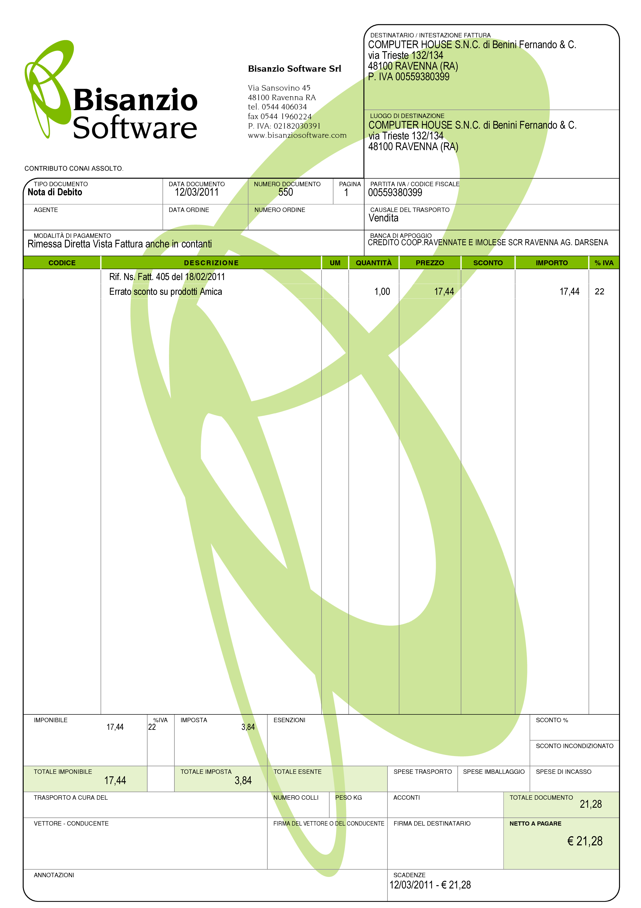
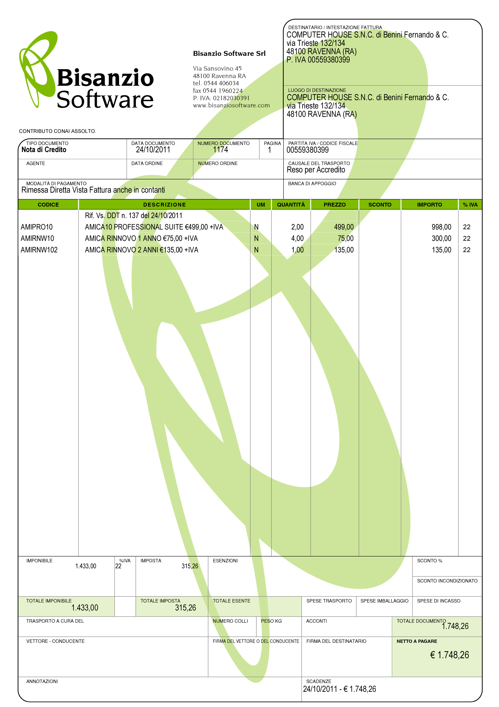

Le Note di Variazione
=====================
La Nota di Variazione è un documento che serve a correggere in aumento o in diminuzione una fattura emessa con valori errati. Questo tipo di documento, disciplinato dall’articolo 26 del `DPR 633/72`_, deve essere emesso quando, dopo l’emissione della fattura e/o la sua registrazione, si verificano delle circostanze tali da determinare una variazione (in aumento o in diminuzione) di quanto indicato. Ecco alcuni esempi:

- quando viene riscontrato un errore nella aliquota IVA applicata, o nella base imponibile oppure nell’imposta;
- quando viene riconosciuto al cliente uno sconto o un abbuono non riportato in fattura;
- quando l’operazione, per varie cause, viene resa nulla come ad esempio con la rescissione o l’annullamento del contratto di vendita.

La Nota di Variazione ha gli stessi requisiti della fattura e deve quindi essere regolarmente numerata e datata. La nota di variazione deve essere emessa, con riferimento all’originaria fattura, per la differenza dell’importo risultante errato o concesso a titolo di sconto, ecc.

Esistono due tipi di note di variazione che prendono rispettivamente il nome di Nota di Debito (o Addebito) e Nota di Credito (o Accredito); vediamole nel dettaglio.

Nota di Debito – Variazione in aumento
--------------------------------------
Nel caso in cui, dopo l’emissione della fattura o la sua registrazione, aumenta l’imponibile ai fini IVA dell’operazione e la relativa imposta per qualsiasi motivo, incluso la correzione di errori o inesattezze, è necessario, per mantenere la contabilità allineata con la situazione reale dell’operazione o contratto, emettere questo documento che certifichi la variazione intervenuta. Seguendo quanto previsto dal suddetto art. 26, l’emissione della nota di debito è un obbligo a carico del contribuente. Naturalmente la sua emissione, se resa necessaria a causa dell’irregolarità della fattura originale, non esonera dal rischio di sanzioni. Si potrà fare ricorso al ravvedimento operoso (art. 13 del D.L. 472/97) per evitarle. Per le note di debito, poiché per l’erario sono un aumento di imposta, la legge non ha posto limiti di tempo per la loro emissione. Andranno ovviamente osservati correttamente gli adempimenti di fatturazione, registrazione, liquidazione e versamento delle imposte.

Alcuni esempi in cui serve emettere Nota di Debito:

- L’importo fatturato non è comprensivo di tutte le operazioni eseguite (merce in eccesso, prestazioni fatturate ad importi inferiori a quanto previsto da accordi, merci di natura e qualità diversa ecc.)
- Uno sconto applicato per una particolare modalità di pagamento, poi variata in altra che ne prevede uno minore o nessuno sconto.
- Uno sconto applicato direttamente in fattura al Cliente per il rispetto di determinate condizioni contrattuali poi non rispettate.

Ecco una Nota di Debito fatta con il programma `Amica Fatturazione`_:

Nota di Credito – Variazione in diminuzione
-------------------------------------------
Quando, dopo l’emissione di regolare fattura a fronte di un’operazione, questa viene meno in parte o del tutto, ovvero ne diminuisce l’imponibile, il cedente del bene (merci o simili) o il prestatore del servizio può effettuare una variazione in diminuzione dell’imponibile con questo documento.

Per la nota di accredito non sono previsti specifici requisiti, pertanto essa assume l’aspetto di una fattura (frequentemente si utilizza lo stesso modulo delle fatture e si sostituisce la dicitura “fattura” con “nota di accredito” o similare). La Nota di Credito deve essere numerata seguendo la stessa progressione delle fatture e datata correttamente, deve contenere l’indicazione della variazione e della relativa imposta e i dati identificativi della fattura originaria a cui si riferisce.

Alcuni esempi:

- dichiarazione di nullità, annullamento, revoca, risoluzione, rescissione del contratto;
- mancato ritiro della merce da parte cliente (ad esempio merce inviata con Corriere e respinta);
- successiva applicazione di sconti o abbuoni previsti nel contratto originario;
- correzione per mancati sconti concordati e non applicati in fase di fatturazione.
- prestazione concordata non svolta completamente o correttamente
- errori nel calcolo dell’imposta, dell’imponibile o di entrambi
- reso di materiali difettosi non sostituibili
- accordi di reso di cui si verificano le condizioni

Le dovute rettifiche per i casi sopra specificati possono essere effettuate tramite una “nota di credito” per le rettifiche in diminuzione dell’imponibile rispetto alla fattura originale.

A differenza delle note di debito, per le note di credito non è previsto l’obbligo di emissione. La mancanza di tale obbligo è facilmente spiegabile in considerazione del fatto che tale diritto è solo posto a tutela del contribuente che ha emesso una fattura con un imponibile e/o un’imposta superiore a quelli corretti, quindi il mantenimento di questa situazione non genera nessun danno all’erario (a parte le operazioni non imponibili che rientrano nel calcolo del plafond per gli esportatori abituali).

Nell’articolo 26 della Legge IVA sono regolamentate le note di credito e le regole a cui sottostare per la loro completa regolarità. La norma generale prevede che tutte le note di credito debbano essere emesse entro un anno dalla “effettuazione dell’operazione” (di norma l’emissione della fattura relativa ad una fornitura e/o ad una prestazione) qualora la variazione dell’imponibile derivi da un sopravvenuto accordo tra le parti.

Sono però espressamente previsti alcuni casi in cui limite di un anno è superato e non ci sono limiti di tempo per l’emissione:

- situazioni che portano alla nullità, all’annullamento, alla revoca, alla risoluzione, alla rescissione e similari della cessione/prestazione (se non derivanti da sopravvenuto accordo tra le parti);
- la presenza di sconti e abbuoni già previsti nel contratto originale (e quindi non accordati in un tempo successivo);
- mancato pagamento (totale o parziale) a seguito di procedure concorsuali o di procedure esecutive non andate a buon fine

Fin qui quanto esplicitamente previsto dalla legge. Esistono però alcune situazioni che nel tempo sono state oggetto di risoluzioni e risposte a interpellanze da parte dell’Agenzia delle Entrate, che hanno legittimato altri casi in cui è possibile emettere note di credito senza limitazioni temporali. Sarebbe complesso farne una trattazione dettagliata, ma riporto i casi più diffusi nei quali ci si può imbattere:

- Conversione di decreti legge (risoluzione n. 106 del 21/05/2007);
- la vendita ai sensi dell’ art. 1401 c.c. (risposta a istanza di interpello n. 909-20845 del 09/05/2002);
- agevolazione prima casa (risoluzione n. 187 del 7/12/2000);
- fattura in sospensione di imposta emesse ad enti pubblici (risoluzione n. 75 del 5/3/2002)

Vediamo ora di analizzare in specifico questi quattro casi proposti.

CONVERSIONE DI DECRETI LEGGE
^^^^^^^^^^^^^^^^^^^^^^^^^^^^
Durante il processo legislativo dei decreti legge può accadere che una norma prevista in un decreto venga poi annullata, del tutto o parzialmente, o comunque modificata dalla Legge di conversione. In questo caso l’Agenzia delle Entrate (RM 106/07) ha riconosciuto la possibilità di emettere note di credito in conformità con le nuove normative senza limiti di tempo.

VENDITA AI SENSI DELL’ ART. 1401 C.C.
^^^^^^^^^^^^^^^^^^^^^^^^^^^^^^^^^^^^^
Un caso piuttosto frequente nelle compravendite immobiliari è stipulare il “preliminare di acquisto” ai sensi dell’art. 1401 del c.c., cioè indicando quale acquirente un generico “persona da nominare” oppure un nominativo che non sarà poi l’effettivo acquirente. Al momento del rogito notarile verrà poi indicato l’acquirente definitivo. L’Agenzia delle Entrate, in risposta ad interpellanza, ha precisato che in questo caso possono essere emesse note di variazione senza limiti di tempo, annullando quindi le fatture fatte in precedenza, in modo tale da riemetterle a favore dell’acquirente reale successivamente nominato ed individuato.

AGEVOLAZIONE PRIMA CASA
^^^^^^^^^^^^^^^^^^^^^^^
La RM 187/00 ha consentito la nota di credito senza limiti di tempo nel caso in cui l’acquirente o committente abbia ottenuto i requisiti necessari per accedere alle agevolazioni prima casa, prima della stipula notarile o alla consegna dell’abitazione, nella fattispecie l’accesso all’IVA agevolata del 4% in luogo del 10% precedentemente fatturato per acconti, caparre e quant’altro.

FATTURA IN SOSPENSIONE DI IMPOSTA EMESSE AD ENTI PUBBLICI
^^^^^^^^^^^^^^^^^^^^^^^^^^^^^^^^^^^^^^^^^^^^^^^^^^^^^^^^^
Per le operazioni effettuate nei confronti dello Stato e degli altri soggetti individuati dal comma 5 dell’art. 6 del D.P.R. 26 ottobre 1972, n. 633 (enti pubblici assimilabili), la RM n. 75/02 ha consentito senza limite di tempo l’effettuazione delle note di credito nelle ipotesi di mancato pagamento in tutto o in parte del corrispettivo. Il tutto è legittimato dal fatto che queste sono operazioni con IVA ad “esigibilità differita”. Ciò significa che l’IVA diviene esigibile per l’erario solo all’atto del pagamento del corrispettivo da parte dell’amministrazione pubblica. Così, in caso di mancato pagamento totale o parziale del corrispettivo (per sopravvenuto accordo tra le parti, per annullamento della fattura emessa per errore, ovvero per riduzione del corrispettivo) l’imposta non diviene esigibile benché l’operazione sia stata fatturata. In tale ipotesi sarà dunque possibile emettere la nota credito a favore del cessionario anche oltre l’anno dall’emissione della fattura, in quanto in questo specifico caso la limitazione temporale è irrilevante ai fini dell’imposta che non verrebbe comunque versata dal contribuente. In questo caso la nota di credito in questione assume una funzione sostanzialmente contabile.

Nella risoluzione viene anche precisato che, qualora il cedente o il prestatore abbia invece optato per l’esigibilità immediata dell’imposta, non avvalendosi dunque del vantaggio di esigibilità differita previsto, eventuali successive note di credito correlate all’operazione, potranno essere effettuate entro il termine previsto dall’articolo 26 della legge IVA.

Vediamo infine un esempio di Nota di Credito realizzata con `Amica Fatturazione`_:

Riepilogo
---------
**Maneggiare con cura le Note di Credito.** Si tratta di un documento che diminuisce l’ammontare dei ricavi aziendali per cui è sempre valutato con grande attenzione dagli addetti in cado di controllo fiscale, per cui bisogna sempre che ci siano valide motivazioni per la sua emissione, meglio se accompagnate da documentazione tipo l’interscambio di comunicazioni tra azienda e cliente per un reso di merce difettosa o per un reso per sostituzione della merce o quant’altro.

.. admonition:: Consiglio

    Fate davvero grande attenzione ai casi in cui la Nota di Credito può essere
    emessa recuperando l’iva ed ai casi in cui l’iva viene invece
    ‘persa’ per motivi legati alla normativa. Rileggete bene il paragrafo
    in cui spiego i casi in cui è ammesso emettere una Nota di Credito con IVA
    e quando invece DEVE essere emessa con esclusione IVA Art 26 e le
    precisazioni nel tempo fatte da Agenzia delle Entrate.

Domande Frequenti
-----------------
**Domanda** Mi servirebbe un consiglio. Un nostro fornitore ha emesso una fattura nel 2010 e una nel 2011 per servizi. Ora devono emettere una nota di accredito con F.C. IVA ART. 26. Devono emettere la nota di accredito per l’importo totale delle fatture (IVA compresa) o soltanto per l’imponibile delle due fatture?

**Risposta** Se le fatture hanno più di un anno di vita devono emettere NC FC IVA per il solo imponibile.

**Domanda** Le sarei grato se mi aiutasse a capire se è possibile fare storno e immediata riemissione fattura perché i termini di pagamento sono errati. Diciamo il cliente ha diritto a 60dffm e il primo documento è stato erroneamente emesso a 30dffm. Posso stornare e riemettere con termini corretti? Sarebbe solo per questo motivo.

**Risposta** Non conviene, in questo caso basta una lettera commerciale al cliente in cui gli si comunica che i termini di pagamento sono i nuovi.

**Domanda** In data 2013 ho ricevuto da un fornitore una nota di accredito per storno totale di una fattura del 2012 che ci aveva emesso in esenzione IVA per lettera d’intento, scrivendo i riferimenti della lettera che gli abbiamo inviato nel 2012 mentre nel 2013 non gliela abbiamo inviata. E’ corretto che la nota di accredito sia in esenzione IVA e riporti i riferimenti della lettera d’intento del 2012?

**Risposta** E’ corretto, la NC segue sempre (salvo alcuni casi particolari) l’applicazione dell’iva della fattura oggetto del contratto.

.. _`DPR 633/72`: http://www.normattiva.it/uri-res/N2Ls?urn:nir:stato:decreto.del.presidente.della.repubblica:1972-10-26;633!vig=
.. _`Amica Fatturazione`: http://gestionaleamica.com/Fatturazione
